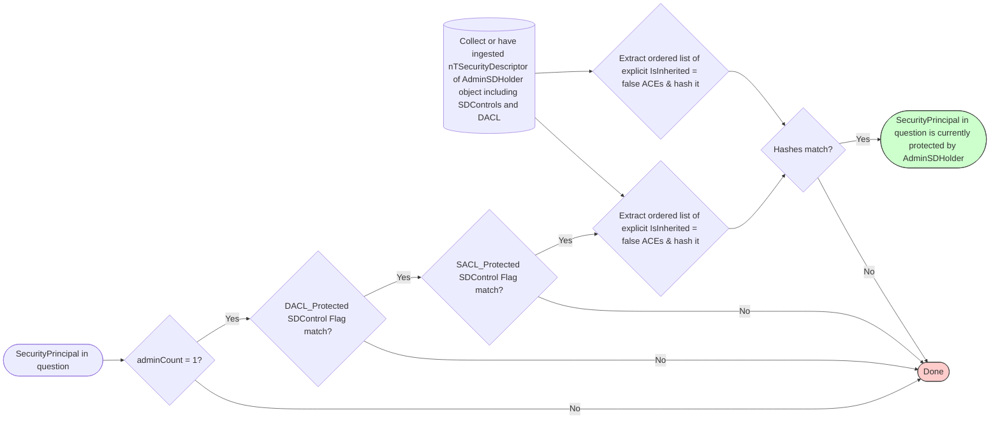

# AdminSDHolder Protection Detection Flowchart

```mermaid
---
config:
  layout: dagre
  theme: default
  look: classic
---
flowchart LR
    A[("Collect or have ingested nTSecurityDescriptor of AdminSDHolder object including SDControls and DACL")] --> B{"Extract ordered list of explicit IsInherited = false ACEs & hash it"} & F{"Extract ordered list of explicit IsInherited = false ACEs & hash it"}
    SP(["SecurityPrincipal in question"]) --> C{"adminCount = 1?"}
    C -- Yes --> D{"DACL_Protected SDControl Flag match?"}
    C -- No --> Done(["Done"])
    D -- Yes --> E{"SACL_Protected SDControl Flag match?"}
    D -- No --> Done
    E -- Yes --> F
    E -- No --> Done
    B --> G{"Hashes match?"}
    F --> G
    G -- Yes --> Protected(["SecurityPrincipal in question is currently protected by AdminSDHolder"])
    G -- No --> Done

     Done:::doneStyle
     Protected:::protectedStyle
    classDef doneStyle fill:#ffcccc,stroke:#333,stroke-width:1px
    classDef protectedStyle fill:#ccffcc,stroke:#333,stroke-width:1px
    %%{init: {'themeVariables': { 'fontSize': '20px'}}}%%
```