# AdminSDHolder Malformed ACEs Issue

While exploring AdminSDHolder security descriptors, I noticed issues with the InheritedObjectType property on the default AdminSDHolder security descriptor. Originally I thought this was an issue with the way the instances of the ActiveDirectoryAccessRule class displayed InheritedObjectType data due to discrepencies between the output there and from viewing the DACL as an SDDL string. For example:

**(OA;;RP;037088f8-0ae1-11d2-b422-00a0c968f939;4828cc14-1437-45bc-9b07-ad6f015e5f28;RU)**<br/>
ActiveDirectoryRights : ReadProperty<br/>
InheritanceType : None<br/>
ObjectType : 037088f8-0ae1-11d2-b422-00a0c968f939<br/>
**InheritedObjectType : 00000000-0000-0000-0000-000000000000**<br/>
ObjectFlags : ObjectAceTypePresent<br/>
AccessControlType : Allow<br/>
IdentityReference : BUILTIN\Pre-Windows 2000 Compatible Access<br/>
IsInherited : False<br/>
InheritanceFlags : None<br/>
PropagationFlags : None<br/>

## Malformed Pre-Win2k ACEs in AdminSDHolder

The example ACE in SDDL is an ObjectAllow grant for the Pre-Windows 2000 Compatible Access (Pre-Win2k) group to ReadProperty on the property set Remote Access Information (ObjectType 037088f8-0ae1-11d2-b422-00a0c968f939) on inetOrgPerson objects (InheritedObjectType 4828cc14-1437-45bc-9b07-ad6f015e5f28). The ActiveDirectoryAccessRule in the example shows the same information, except for the InheritedObjectType, which is an empty guid. When I orignally looked at this, I thought that the empty guid of all zeros was an error. However, with the way the security descriptors are supplied to Windows by the Schema in SDDL format, these Pre-Windows 2000 Compatible Access ACEs with an InheritedObjectType are not properly formed. When they are set by the SYSTEM directly there are no constraints applied, so even if incorrect, they are still applied. If and when any Windows APIs modify the security descriptor, the malformed ACEs are removed.

The intent of this ACE appears to be allow members of Pre-Win2k to read all of the properties in the Remote Access Information property set on descendant inetOrgPerson objects. However, while AdminSDHolder is a container that could theoretically have descendant child objects, it doesn't. And the objects AdminSDHolder protects are those object instances, not descendant objects of AdminSDHolder. They're descendants of whichever OU or container they are placed in. And while objects that AdminSDHolder protects could have child objects, that's not the norm and the majority of the ACEs in the default AdminSDHolder DACL do not have inheritance or propagation flags which would allow them to be inherited by child objects.

In any default AdminSDHolder security descriptor there are multiple ObjectAllow ACE grants to the trustee Pre-Windows 2000 Compatible Access. Every one of these ACEs includes an InheritedObjectType guid. This is true whether you view the security descriptor in the LDP.exe GUI, as a [text dump in LDP.exe](./2019/DefaultAdminSDHolderSD2019LDPTextDump.txt), or in SDDL format:
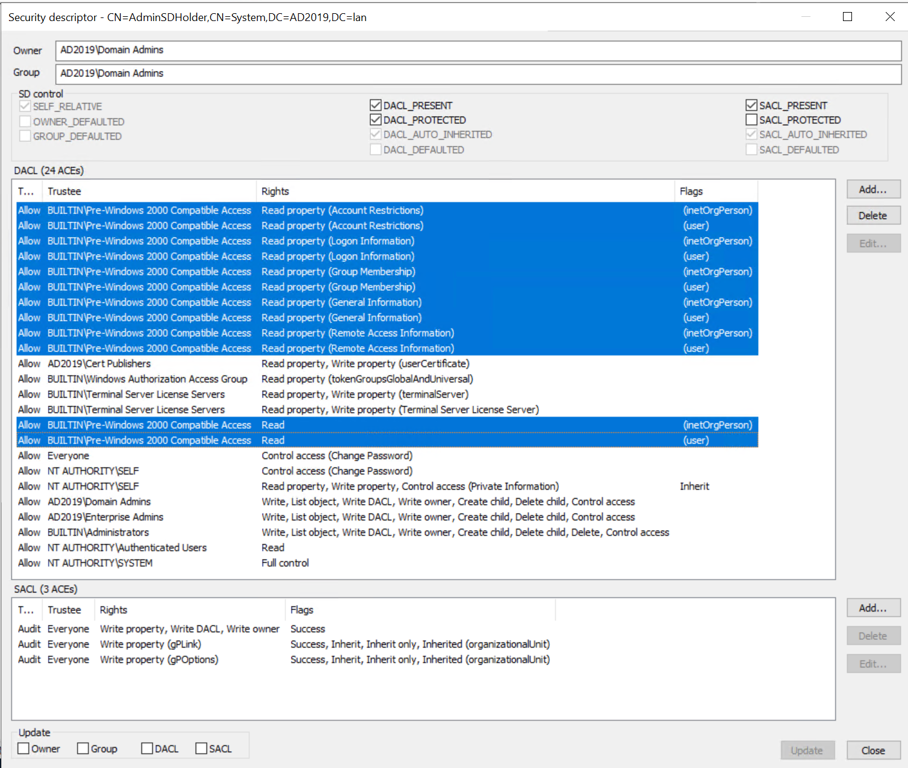

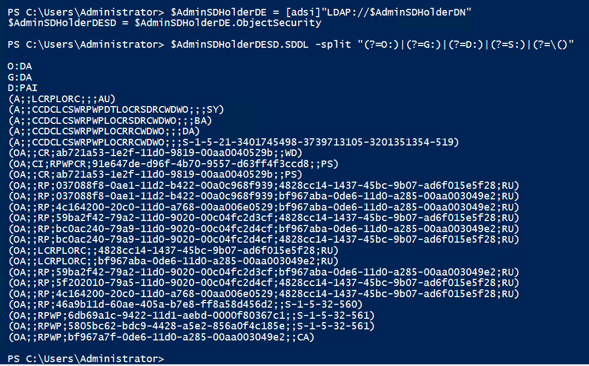

All of the Pre-Win2k ACEs with the InheritedObjectType of User have existed since Windows Server 2000 and were configured by [Schema Update 13](../SchemaAndDomainDefaults/AdminSDHolderDefaults/Schema13SD.png). The additional Pre-Win2k ACEs with the InheritedObjectType of inetOrgPerson have been around since [Schema Update 30](../SchemaAndDomainDefaults/AdminSDHolderDefaults/Schema30SD.png), which coincides with the release to manufacturer of Windows Server 2003.

### ACE Constraints

While doing some testing with the AdminSDHolder security descriptor in the ADPDCeTests.lan forest, I made some changes to the AdminSDHolder security descriptor using the advanced security properties in Active Directory Users and Computers (ADUC). I was skeptical of the Pre-Win2k ACEs in the default AdminSDHolder security descriptor and so I added a new ACE for ADPDCETests\Cert Publishers with an ObjectType of userCertificate and an InheritedObjectType of Users, but without any inheritance or propagation flags set. I noted that this new ACE did not include any Flags when viewing the security descriptor in LDP. The InheritedObjectType was truncated from the ACE because it's not a valid configuration.

Next, I added another ACE for ADPDCETests\InheritedObjectTypeTest with both an ObjectType, an InheritedObjectType, and inheritance flags. This ACE displayed correctly in LDP because it is a valid ACE with valid propagation capacity. But I was surprised by something else at this point: all of the numerous Pre-Win2k ACEs were now gone, replaced by a single GenericRead ACE:
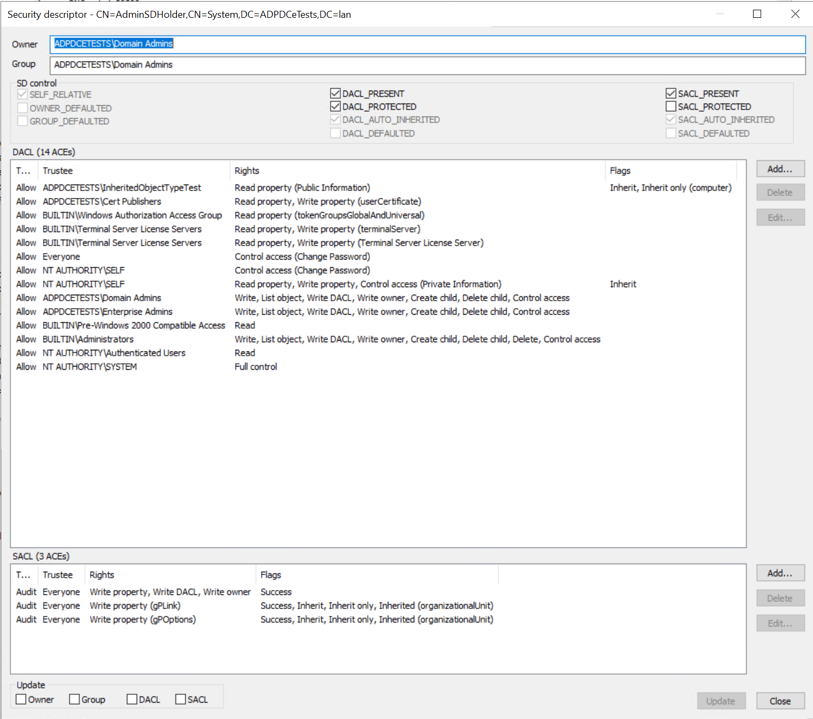

At first, I didn't believe what I was seeing so I went back and looked at the default AdminSDHolder SD for this forest prior to making any changes to the security descriptor or specifically the DACL:


Indeed, the AdminSDHolder object in this forest had a security descriptor consistent with the Schema44 security descriptor:
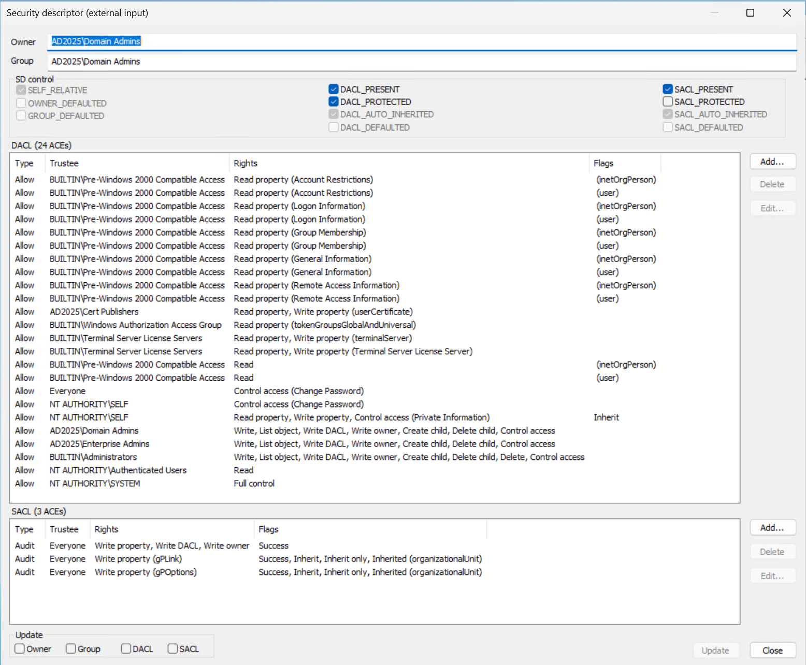

But after modifying the DACL in ADUC, the 12 Pre-Win2k ACEs were consolidated down into 1.

Time for some more testing...

### Test ACEs and SDs as .NET Objects

I did some testing and attempted to create a new instance of an ActiveDirectoryAccessRule which has an InheritedObjectType and no InheritanceFlags using the following:

```PowerShell
$rule = [System.DirectoryServices.ActiveDirectoryAccessRule]::new(
    [System.Security.Principal.SecurityIdentifier]::new("S-1-5-32-544"),  # Identity (Administrators SID as example)
    [System.DirectoryServices.ActiveDirectoryRights]::ReadProperty,       # Rights
    [System.Security.AccessControl.AccessControlType]::Allow,             # Access type
    [System.Guid]::new("f3a64788-5306-11d1-a9c5-0000f80367c1"),          # ObjectType (servicePrincipalName attribute GUID)
    [System.DirectoryServices.ActiveDirectorySecurityInheritance]::None,  # Inheritance type
    [System.Guid]::new("bf967a86-0de6-11d0-a285-00aa003049e2")           # InheritedObjectType (Computer class GUID)
)
```

I can create the ACE with this code with no errors, but when I display the rule we can see the InheritedObjectType is empty (all zeros):
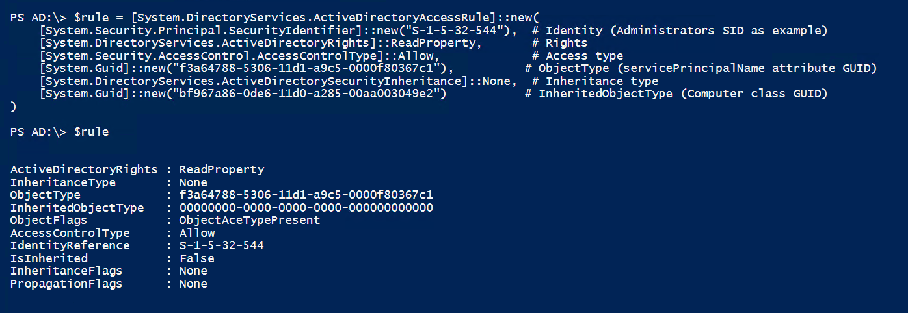

If I take this a step further and create a new instance of an ActiveDirectory security descriptor and add this ACE to it, the results indicate that the InheritedObjectType was dropped completely by the Windows APIs when creating the ACE:

```PowerShell
# Using $rule from above
$sd = [System.DirectoryServices.ActiveDirectorySecurity]::new()
$sd.AddAccessRule($rule)
$sd
$sd.Access
$sd.Sddl
```

This results in an empty InheritedObjectType in both the GetAccessRules() method and when viewd by SDDL:
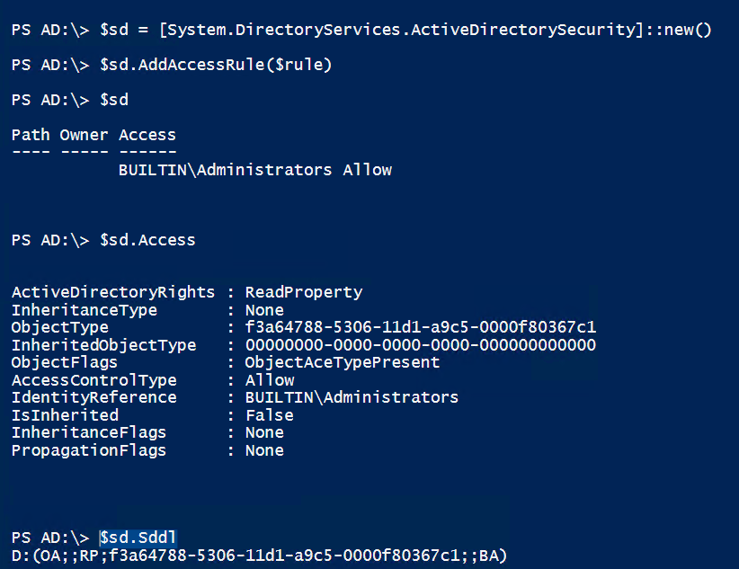

System.DirectoryServices.ActiveDirectorySecurity and System.DirectoryServices.ActiveDirectoryAccessRule are applying constraints to this malformed ACE. And while they are not causing the attempt to error out, they are preventing the error of attempting to supply an InheritedObjectType when there are no inheritance flags configured.

### Testing Security Descriptors from SDDL

Then I thought I'd take a different approach and try to create a new instance of an AD security descriptor with multiple ACEs, each having InheritedObjectTypes. What I did is modify the SDDL for the [Schema Update 44](../SchemaAndDomainDefaults/AdminSDHolderDefaults/Schema44SD.png) AdminSDHolder security descriptor to remove all ACEs that are not for Pre-Win2k (RU):

```PowerShell
$sddl = 'O:DAG:DAD:PAI(OA;;RP;4c164200-20c0-11d0-a768-00aa006e0529;4828cc14-1437-45bc-9b07-ad6f015e5f28;RU)(OA;;RP;4c164200-20c0-11d0-a768-00aa006e0529;bf967aba-0de6-11d0-a285-00aa003049e2;RU)(OA;;RP;5f202010-79a5-11d0-9020-00c04fc2d4cf;4828cc14-1437-45bc-9b07-ad6f015e5f28;RU)(OA;;RP;5f202010-79a5-11d0-9020-00c04fc2d4cf;bf967aba-0de6-11d0-a285-00aa003049e2;RU)(OA;;RP;bc0ac240-79a9-11d0-9020-00c04fc2d4cf;4828cc14-1437-45bc-9b07-ad6f015e5f28;RU)(OA;;RP;bc0ac240-79a9-11d0-9020-00c04fc2d4cf;bf967aba-0de6-11d0-a285-00aa003049e2;RU)(OA;;RP;59ba2f42-79a2-11d0-9020-00c04fc2d3cf;4828cc14-1437-45bc-9b07-ad6f015e5f28;RU)(OA;;RP;59ba2f42-79a2-11d0-9020-00c04fc2d3cf;bf967aba-0de6-11d0-a285-00aa003049e2;RU)(OA;;RP;037088f8-0ae1-11d2-b422-00a0c968f939;4828cc14-1437-45bc-9b07-ad6f015e5f28;RU)(OA;;RP;037088f8-0ae1-11d2-b422-00a0c968f939;bf967aba-0de6-11d0-a285-00aa003049e2;RU)(OA;;LCRPLORC;;4828cc14-1437-45bc-9b07-ad6f015e5f28;RU)(OA;;LCRPLORC;;bf967aba-0de6-11d0-a285-00aa003049e2;RU)'
$sddlsd = [System.DirectoryServices.ActiveDirectorySecurity]::new()
$sddlsd.SetSecurityDescriptorSddlForm($sddl, 15) # 15 is the Flag value for All parts of a security descriptor
$sddlsd.Sddl
$sddlsd.Access
```

The results show that GetAccessRules(), for which Access is a codeproperty, does not display any InheritedObjectTypes. However, the SDDL display of the security descriptor maintains the ACEs with their InheritedObjectType guid:


Would the DACL be modified if we make any modifications to $sddlsd?

```PowerShell
# Create a basic ActiveDirectoryAccessRule
$basicrule = [System.DirectoryServices.ActiveDirectoryAccessRule]::new(
    [System.Security.Principal.SecurityIdentifier]::new("S-1-5-32-544"),  # Identity (Administrators SID as example)
    [System.DirectoryServices.ActiveDirectoryRights]::GenericAll,       # Rights
    [System.Security.AccessControl.AccessControlType]::Allow             # Access type
)
$sddlsd.AddAccessRule($basicrule)
$sddlsd.Sddl
$sddlsd.Access
```

Interestingly enough, adding another ACE does not reset the security descriptor like it does when modifying the actual AdminSDHolder security descriptor in an AD domain:
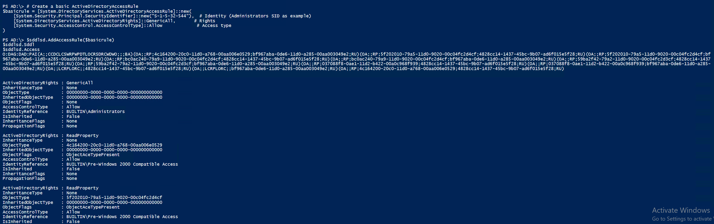

This does make sense as modifications made by setting a security descriptor via SDDL will not apply the same constraints (or API) as when individual ActiveDirectoryAccessRules are added to make an ActiveDirectorySecurity object.

### More SDDL Tests with TestContainer4

Could we apply this security to an AD object? Would AD's additional constraints on security descriptors apply when comitting the data? Let's create an example object and try. In the $sddl2 string below I've taken the Pre-Win2k ACEs that have both an ObjectType and InheritedObjectType and combined them with the default Owner, Group, and SD Flags of the AdminSDHolder default security descriptor. I've also added an additional ACE allowing Domain Admins GenericRead, CreateChild, and DeleteChild.

```PowerShell
$sddl2 = 'O:DAG:DAD:PAI(OA;;RP;4c164200-20c0-11d0-a768-00aa006e0529;4828cc14-1437-45bc-9b07-ad6f015e5f28;RU)(OA;;RP;4c164200-20c0-11d0-a768-00aa006e0529;bf967aba-0de6-11d0-a285-00aa003049e2;RU)(OA;;RP;5f202010-79a5-11d0-9020-00c04fc2d4cf;4828cc14-1437-45bc-9b07-ad6f015e5f28;RU)(OA;;RP;5f202010-79a5-11d0-9020-00c04fc2d4cf;bf967aba-0de6-11d0-a285-00aa003049e2;RU)(OA;;RP;bc0ac240-79a9-11d0-9020-00c04fc2d4cf;4828cc14-1437-45bc-9b07-ad6f015e5f28;RU)(OA;;RP;bc0ac240-79a9-11d0-9020-00c04fc2d4cf;bf967aba-0de6-11d0-a285-00aa003049e2;RU)(OA;;RP;59ba2f42-79a2-11d0-9020-00c04fc2d3cf;4828cc14-1437-45bc-9b07-ad6f015e5f28;RU)(OA;;RP;59ba2f42-79a2-11d0-9020-00c04fc2d3cf;bf967aba-0de6-11d0-a285-00aa003049e2;RU)(OA;;RP;037088f8-0ae1-11d2-b422-00a0c968f939;4828cc14-1437-45bc-9b07-ad6f015e5f28;RU)(OA;;RP;037088f8-0ae1-11d2-b422-00a0c968f939;bf967aba-0de6-11d0-a285-00aa003049e2;RU)(A;;RPRCLOLCCCDC;;;DA)'
New-ADContainer -ContainerName 'TestContainer4' -ParentPath 'OU=Misconfigs,DC=AD2019,DC=lan' -SDDL $sddl2
```

Here's the command output showing the SDDL applied:
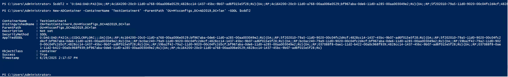

Here's the security descriptor of TestContainer4 in ADUC Advanced. Note how ADUC cannot properly describe this security descriptor.
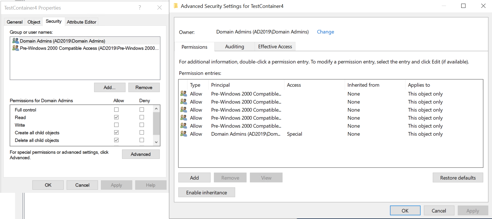

Here's the security descriptor of TestContainer4 in LDP as both an image and [text dump](./2019/LDP-TestContainer4-Baseline.txt). Note that each Pre-Win2k ACE has "Flags" that correspond to the InheritedObjectType specified in each ACE. These are allowed by AD as I set the entire security descriptor at once via SDDL. Once I modify the security descriptor's DACL, the ACEs will be normalized.
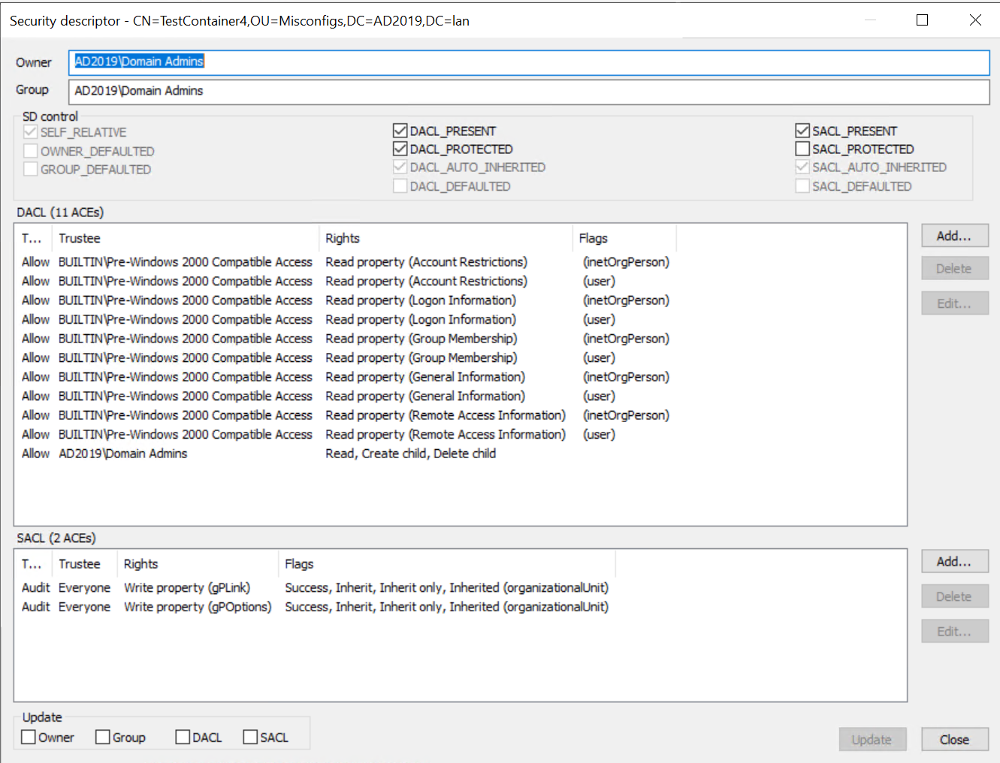

We now know that creating an ActiveDirectorySecurity object from SDDL and applying it to an instance of an AD Object does not apply ACE constraints. Now we can try to figure out the exact security descriptor modification that triggers the results I noted earlier in the AdminSDHolder object in the ADPDCeTests.lan forest.

### Testing TestContainer4 Modifications

To test whether the constraints apply when I modify the security descriptor, the ACL, or specifically the DACL, I'll start by modifying the Group in the security descriptor of TestContainer4:
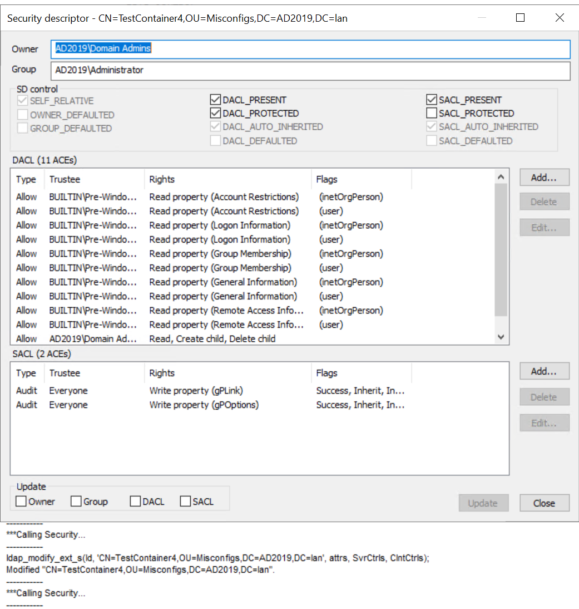

Modifying the security descriptor by changing the group did not cause AD to apply constraints to the ACEs. How about if we modify the ACL by adding a SACL ACE entry?
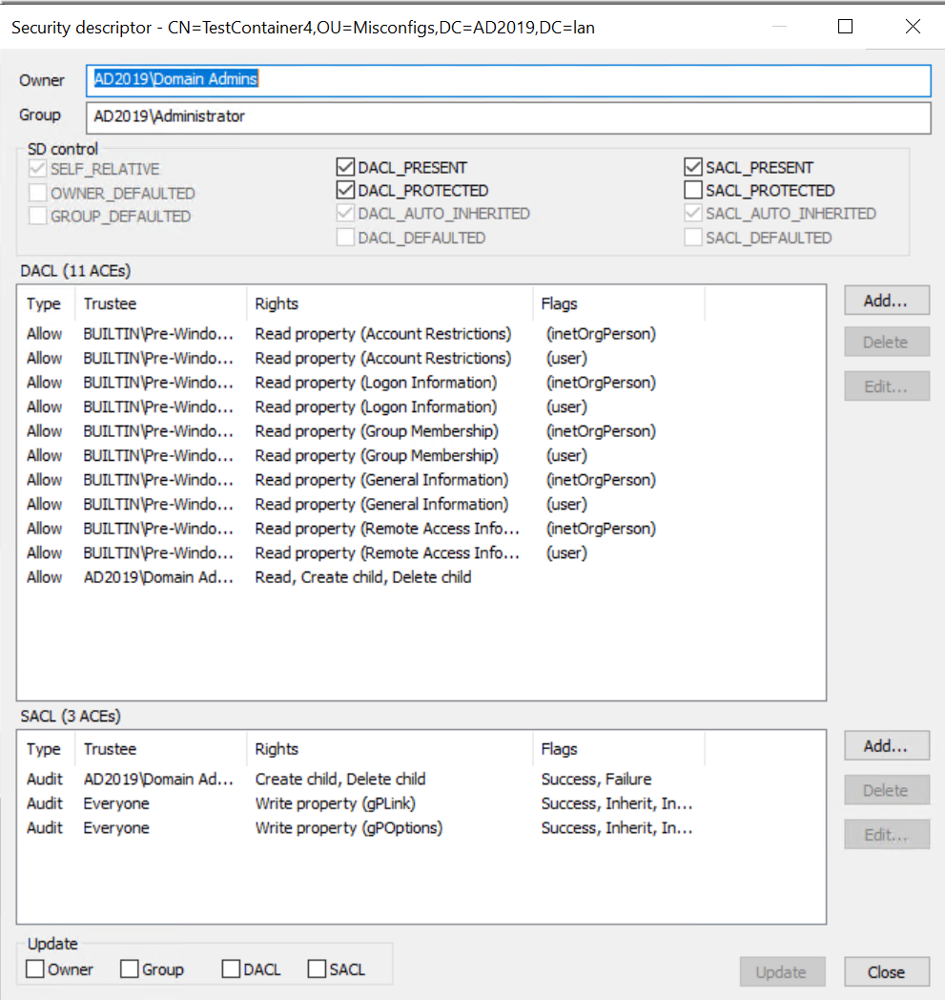

Modifying the SACL didn't cause AD to apply constraints to the ACEs. So I'll modify the DACL now by changing the Domain Admins ACE from GenericRead, CreateChild, DeleteChild to GenericAll:
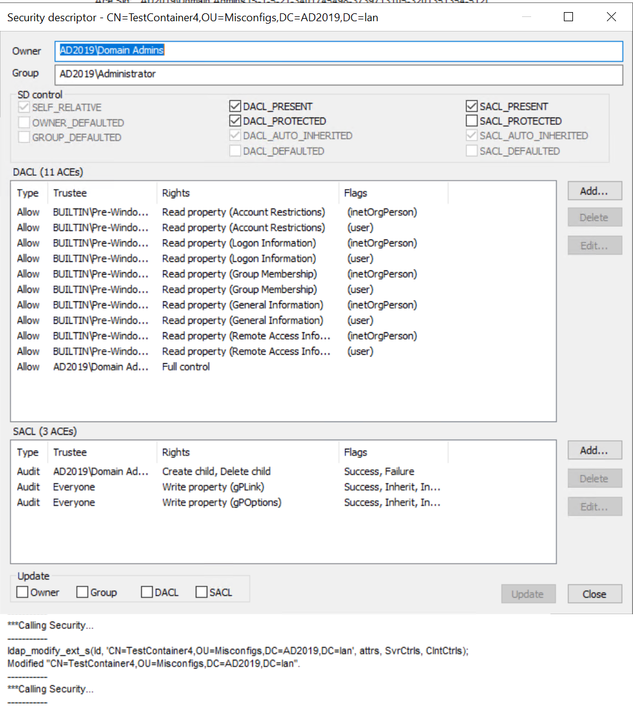

That didn't change anything either. So it's not AD itself that is applying constraints to the ACEs as I'm seeing in other domains. Perhaps it is specific security descriptor APIs, like those used in ADUC? I'll change the Owner Administrator in the ADUC SD advanced settings and then view the SD in LDP:
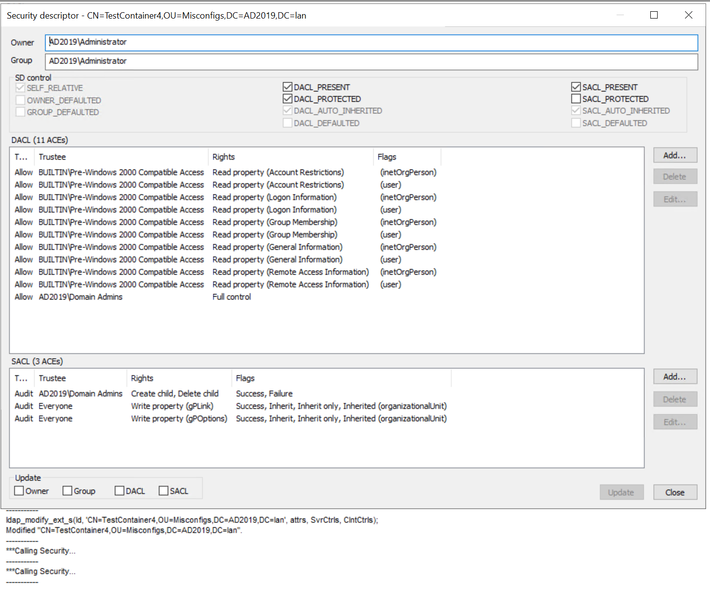

That didn't change the ACEs. I'll modify the SACL this time in ADUC SD advanced settings by removing the Domain Admins audit ACE and then view the security descriptor in LDP:
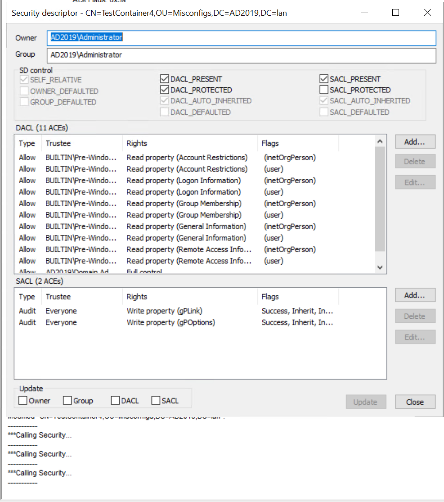

Nope! The SACL change in ADUC didn't modify the ACEs. I guess that makes sense. Now we'll modify the DACL by changing the Domain Admins ACE back to GenericRead, CreateChild, DeleteChild from GenericAll. Or at least as close to that as we can easily do in ADUC, and then view the security descriptor in LDP:
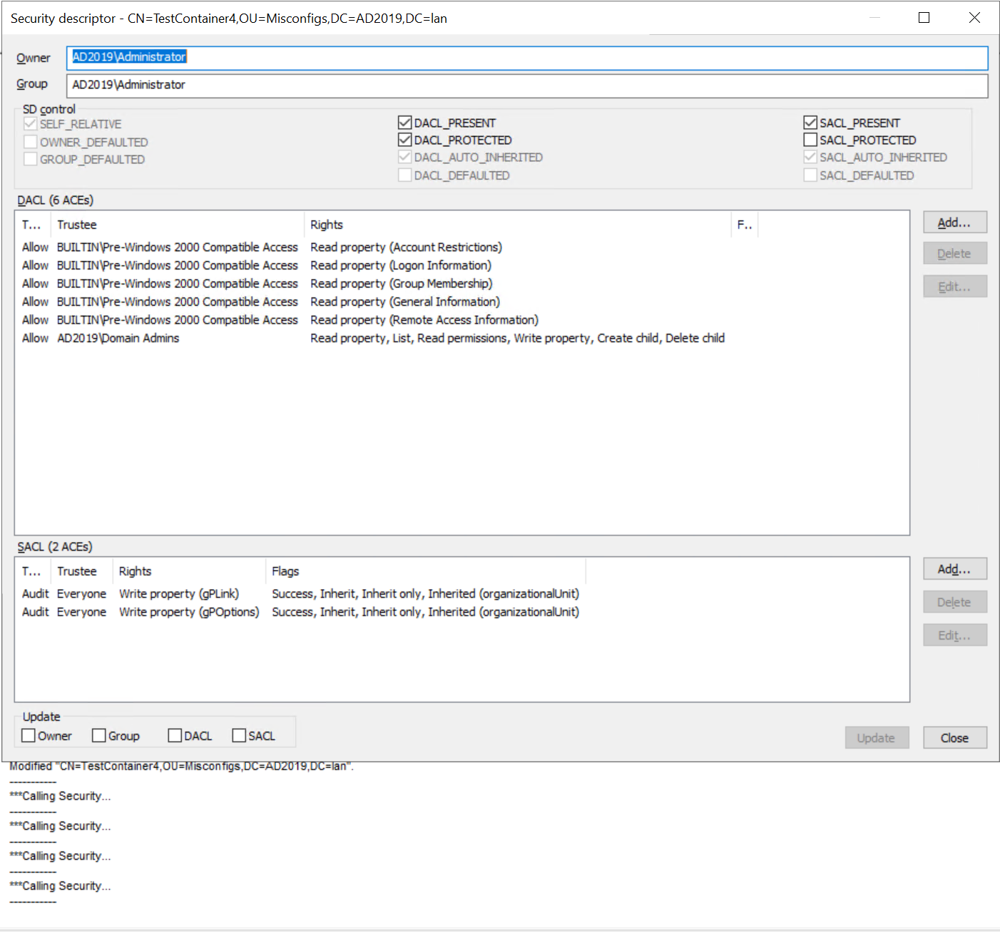

That did it! Look at the difference between this screenshot and the previous screenshot. There are no more flags now on any ACE in the DACL. All of the Pre-Win2k ACEs lost their InheritedObjectType. This is the same behavior that I'm seeing when a default AdminSDHolder security descriptor is modified in ADUC, with the exception that multiple ReadProperty ACEs with specific ObjectTypes are consolidated in with the ReadProperty without any ObjectType ACE. The security descriptor APIs used by Active Directory Users and Computers enforce appropriate ACE constraints any time the DACL is committed. I've also uploaded an [LDP text dump of the security descriptor](./2019/LDP-TestContainer4-PostTests.txt) of TestContainer4 after I made the 3 changes in LDP and the 3 changes in ADUC, where the modification of the DACL in ADUC caused all ACEs to have constraints applied.

## Validating Malformed ACEs

I thought about this a bit more and figured it was worthwhile to attempt to validate that these malformed ACEs are indeed malformed by mocking up some security descriptors via SDDL that have malformed ACEs I can methodically test for functionality. Instead of using the Pre-Win2k group, I'll create a few custom groups. I'll also be sure to use ObjectType guids that the advanced security settings in ADUC are capable of displaying, unlike those in the default AdminSDHolder security descriptor. I'll perform these tests in the ADPDCeTests.lan forest and place collected data in the /Misc/ADPDCeTestsMalformedACEs directory of this GitHub repository.

1. Collect some baseline data:

- [AdminSDHolder-SD-Baseline.txt](./ADPDCeTestMalformedACEs/AdminSDHolder-SD-Baseline.txt)
- [Test-AdminSDHolderBaseline.xslx](./ADPDCeTestMalformedACEs/Test-AdminSDHolderBaseline.xlsx)
  > [!NOTE] TestSDUser2
  > Note that the user CN=TestSDUser2,CN=TestAdminSDHolderSD2,OU=Misconfigs,DC=ADPDCeTests,DC=lan was previously created with the New-ADUserWithAdminSDSecurity.ps1 script, which is why it has an adminCount of 0 but has a security descriptor that is an ImplicitSDMatch with that of AdminSDHolder. This is an issue with my hashing comparison design that I'll need to address in SharpHound.

2. Create some groups:
   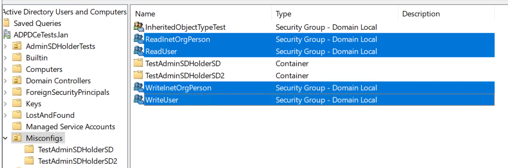

3. Gather the SIDs of the new groups:

```PowerShell
# Commands
Get-ADGroup -Identity 'ReadUser' | Select-Object -Property Name, DistinguishedName, SID
Get-ADGroup -Identity 'ReadInetOrgPerson' | Select-Object -Property Name, DistinguishedName, SID
Get-ADGroup -Identity 'WriteUser' | Select-Object -Property Name, DistinguishedName, SID
Get-ADGroup -Identity 'WriteInetOrgPerson' | Select-Object -Property Name, DistinguishedName, SID

# Output
Name               DistinguishedName                                         SID
----               -----------------                                         ---
ReadUser           CN=ReadUser,OU=Misconfigs,DC=ADPDCeTests,DC=lan           S-1-5-21-2601650231-2489531028-1063739222-3452
ReadInetOrgPerson  CN=ReadInetOrgPerson,OU=Misconfigs,DC=ADPDCeTests,DC=lan  S-1-5-21-2601650231-2489531028-1063739222-3453
WriteUser          CN=WriteUser,OU=Misconfigs,DC=ADPDCeTests,DC=lan          S-1-5-21-2601650231-2489531028-1063739222-3454
WriteInetOrgPerson CN=WriteInetOrgPerson,OU=Misconfigs,DC=ADPDCeTests,DC=lan S-1-5-21-2601650231-2489531028-1063739222-3455
```

3. Replace the AdminSDHolder DACL to give it some test ACEs. I'll use the Public Information property set, which has a guid of e48d0154-bcf8-11d1-8702-00c04fb96050:
   For reference, the 4828cc14-1437-45bc-9b07-ad6f015e5f28 guid corresponds to the inetOrgPerson objectClass and the bf967aba-0de6-11d0-a285-00aa003049e2 guid is the User objectClass.

```PowerShell
$sddl = 'O:DAG:DAD:PAI(OA;;RP;e48d0154-bcf8-11d1-8702-00c04fb96050;4828cc14-1437-45bc-9b07-ad6f015e5f28;S-1-5-21-2601650231-2489531028-1063739222-3453)(OA;;RP;e48d0154-bcf8-11d1-8702-00c04fb96050;bf967aba-0de6-11d0-a285-00aa003049e2;S-1-5-21-2601650231-2489531028-1063739222-3452)(OA;;WP;e48d0154-bcf8-11d1-8702-00c04fb96050;4828cc14-1437-45bc-9b07-ad6f015e5f28;S-1-5-21-2601650231-2489531028-1063739222-3455)(OA;;WP;e48d0154-bcf8-11d1-8702-00c04fb96050;bf967aba-0de6-11d0-a285-00aa003049e2;S-1-5-21-2601650231-2489531028-1063739222-3455)(A;;RCLCLO;;;AU)(A;;CCDCLCSWRPWPDTLOCRSDRCWDWO;;;SY)(A;;CCDCLCSWRPWPLOCRSDRCWDWO;;;BA)(A;;CCDCLCSWRPWPLOCRRCWDWO;;;DA)'
Set-AdminSDHolderSecurity -SDDL $sddl -BackupCurrentSecurity
```

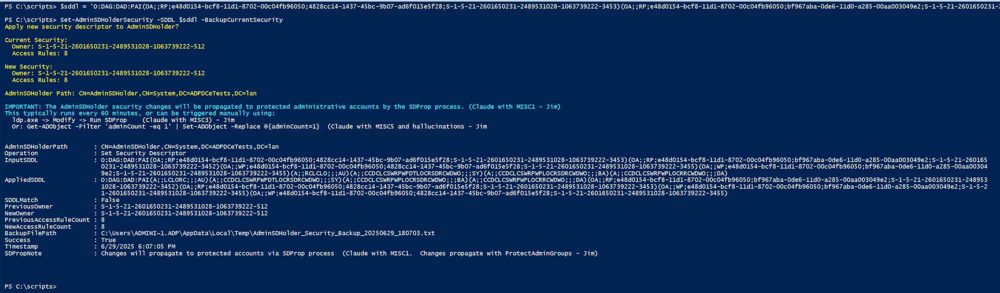

4. Review the resulting AdminSDHolder security descriptor:
   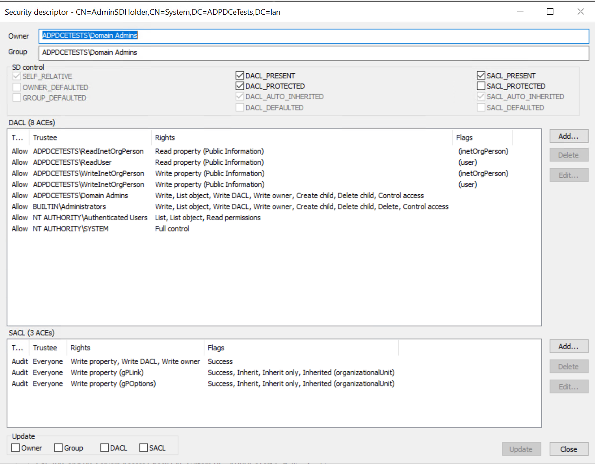

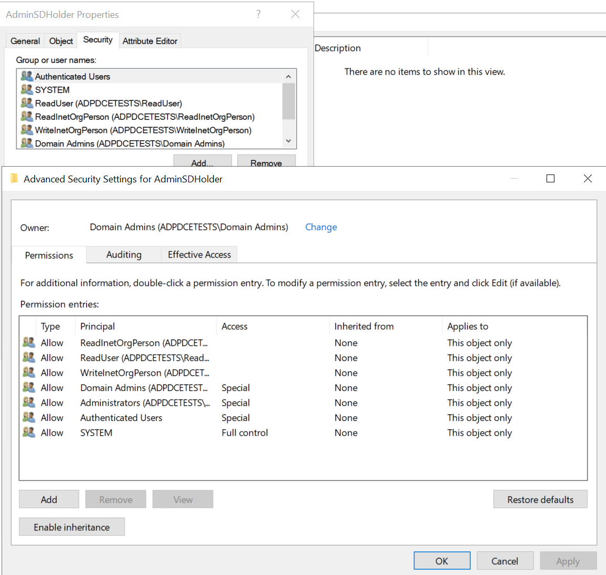

5. Review Effective Access:

- [ReadUser](./ADPDCeTestMalformedACEs/5-ReadUserEffectiveAccess.mp4)

## Incorrect First Observations

> [!NOTE]
> I originally made some incorrect and mostly incomplete observations when first digging into the issue of these Pre-Win2k ACEs in the default AdminSDHolder security descriptor. I'm an imperfect being who makes a lot of mistakes. Mistakes are normal and part of the learning process. So I choose to leave some of my mistakes in my work to show how I went wrong and how I resolved the issue.

In the GetAccessRules() method of the [System.Security.AccessControl.DirectoryObjectSecurity](https://learn.microsoft.com/en-us/dotnet/api/system.security.accesscontrol.directoryobjectsecurity?view=net-9.0)
class, which results in an [AuthorizationRuleCollection](https://learn.microsoft.com/en-us/dotnet/api/system.security.accesscontrol.authorizationrulecollection?view=net-9.0) of [ActiveDirectoryAccessRule](https://learn.microsoft.com/en-us/dotnet/api/system.directoryservices.activedirectoryaccessrule?view=windowsdesktop-9.0) objects, there appears to be a bug in the display of InheritedObjectType property. It always displays an empty guid (00000000-0000-0000-0000-000000000000) instead of the actual value. I first noticed this when reviewing output of type [System.Security.AccessControl.ActiveDirectorySecurity](https://learn.microsoft.com/en-us/dotnet/api/system.directoryservices.activedirectorysecurity?view=windowsdesktop-9.0) across the various AdminSDHolder data collections.

This behavior occurs accross Active Directory domain controllers from Windows Server 2008 R2 through Windows Server 2025. It's repeatable with Windows PowerShell (5.1) and the current latest version (7.5.2). I have not yet tested it in C#.

The GetAccessRules() method on [System.Security.AccessControl.ActiveDirectorySecurity] is inherited from the parent class [System.Security.AccessControl.DirectoryObjectSecurity]. Regardless of whether the 'Access' CodeProperty or the GetAccessRules() method are called, the results in each ActiveDirectoryAccessRule are the same. It should go without saying, as they both result in an instance of the same object class, but the results are the same when accessing the DACL of an AD object via pure .NET methods or via Get-ACL.

I've uploaded a [transcript](GetAccessRuleTranscript.txt) of PowerShell output confirming the bug. The transcript also demonstrates that James Forshaw's NTObjectManager module properly parses and displays the InheritedObjectType via the Format-Win32SecurityDescriptor function.

> [!NOTE] Finding the Correct Path
> While testing this I had blinders on or had developed tunnel vision only for AdminSDHolder. I confirmed the behavior on AdminSDHolder and AdminSDHolder across multiple forest with multiple DCs of various Windows OSes and saw the same behavior. But I wasn't looking at a broad enough sample of objects. Once I looked at some other objects and ensured I had objects with properly configured ACEs with InheritedObjectType guids and the correct corresponding Inheritance Flags I knew I had a case of tunnel vision. I started looking more broadly and realized the issue was not with how .NET was displaying these ACEs, but rather how these ACEs were formed in the first place: they were created by the system during DC promo using SDDL formatted security descriptors that are part of the AD schema updates.

## Default Security Descriptor Data

Below, the same security descriptor is presented in SDDL format (newlines added for ease of reading) and via the GetAccessRules() method of System.Security.AccessControl.ActiveDirectorySecurity, which is inherited from System.Security.AccessControl.DirectoryObjectSecurity and results in an AuthorizationRuleCollection of ActiveDirectoryAccessRule objects. Above each ACE in the GetAccessRules() output I copied the corresponding SDDL ACE.

Note in the SDDL format that all ACEs for the trustee BUILTIN\Pre-Windows 2000 Compatible Access (RU) include an InheritedObjectType.
However, none of the BUILTIN\Pre-Windows 2000 Compatible Access ACEs in the GetAccessRules output contain that InheritedObjectType guid.

> [!NOTE]
> The ACEs displayed as instances of the ActiveDirectoryAccessRule class do not have the InheritedObjectType guid because those ACEs are malformed and the InheritedObjectType does not apply to an ACE which does not also have the capacity to propagate to a child object of that object class.

The errant ACEs have been highlighted in **bold** font.

O:DA<br/>
G:DA<br/>
D:PAI<br/>
(A;;LCRPLORC;;;AU)<br/>
(A;;CCDCLCSWRPWPDTLOCRSDRCWDWO;;;SY)<br/>
(A;;CCDCLCSWRPWPLOCRSDRCWDWO;;;BA)<br/>
(A;;CCDCLCSWRPWPLOCRRCWDWO;;;DA)<br/>
(A;;CCDCLCSWRPWPLOCRRCWDWO;;;S-1-5-21-1753113456-3794003277-551465778-519)<br/>
(OA;;CR;ab721a53-1e2f-11d0-9819-00aa0040529b;;WD)<br/>
(OA;CI;RPWPCR;91e647de-d96f-4b70-9557-d63ff4f3ccd8;;PS)<br/>
(OA;;CR;ab721a53-1e2f-11d0-9819-00aa0040529b;;PS)<br/>
(OA;;RP;037088f8-0ae1-11d2-b422-00a0c968f939;4828cc14-1437-45bc-9b07-ad6f015e5f28;RU)<br/>
(OA;;RP;037088f8-0ae1-11d2-b422-00a0c968f939;bf967aba-0de6-11d0-a285-00aa003049e2;RU)<br/>
(OA;;RP;4c164200-20c0-11d0-a768-00aa006e0529;bf967aba-0de6-11d0-a285-00aa003049e2;RU)<br/>
(OA;;RP;59ba2f42-79a2-11d0-9020-00c04fc2d3cf;4828cc14-1437-45bc-9b07-ad6f015e5f28;RU)<br/>
(OA;;RP;bc0ac240-79a9-11d0-9020-00c04fc2d4cf;bf967aba-0de6-11d0-a285-00aa003049e2;RU)<br/>
(OA;;RP;bc0ac240-79a9-11d0-9020-00c04fc2d4cf;4828cc14-1437-45bc-9b07-ad6f015e5f28;RU)<br/>
(OA;;LCRPLORC;;4828cc14-1437-45bc-9b07-ad6f015e5f28;RU)<br/>
(OA;;LCRPLORC;;bf967aba-0de6-11d0-a285-00aa003049e2;RU)<br/>
(OA;;RP;59ba2f42-79a2-11d0-9020-00c04fc2d3cf;bf967aba-0de6-11d0-a285-00aa003049e2;RU)<br/>
(OA;;RP;5f202010-79a5-11d0-9020-00c04fc2d4cf;4828cc14-1437-45bc-9b07-ad6f015e5f28;RU)<br/>
(OA;;RP;4c164200-20c0-11d0-a768-00aa006e0529;4828cc14-1437-45bc-9b07-ad6f015e5f28;RU)<br/>
(OA;;RP;46a9b11d-60ae-405a-b7e8-ff8a58d456d2;;S-1-5-32-560)<br/>
(OA;;RPWP;6db69a1c-9422-11d1-aebd-0000f80367c1;;S-1-5-32-561)<br/>
(OA;;RPWP;5805bc62-bdc9-4428-a5e2-856a0f4c185e;;S-1-5-32-561)<br/>
(OA;;RPWP;bf967a7f-0de6-11d0-a285-00aa003049e2;;CA)<br/>

(A;;LCRPLORC;;;AU)<br/>
ActiveDirectoryRights : GenericRead<br/>
InheritanceType : None<br/>
ObjectType : 00000000-0000-0000-0000-000000000000<br/>
InheritedObjectType : 00000000-0000-0000-0000-000000000000<br/>
ObjectFlags : None<br/>
AccessControlType : Allow<br/>
IdentityReference : NT AUTHORITY\Authenticated Users<br/>
IsInherited : False<br/>
InheritanceFlags : None<br/>
PropagationFlags : None<br/>

(A;;CCDCLCSWRPWPDTLOCRSDRCWDWO;;;SY)<br/>
ActiveDirectoryRights : GenericAll<br/>
InheritanceType : None<br/>
ObjectType : 00000000-0000-0000-0000-000000000000<br/>
InheritedObjectType : 00000000-0000-0000-0000-000000000000<br/>
ObjectFlags : None<br/>
AccessControlType : Allow<br/>
IdentityReference : NT AUTHORITY\SYSTEM<br/>
IsInherited : False<br/>
InheritanceFlags : None<br/>
PropagationFlags : None<br/>

(A;;CCDCLCSWRPWPLOCRSDRCWDWO;;;BA)<br/>
ActiveDirectoryRights : CreateChild, DeleteChild, Self, WriteProperty, ExtendedRight, Delete, GenericRead, WriteDacl,<br/>
WriteOwner<br/>
InheritanceType : None<br/>
ObjectType : 00000000-0000-0000-0000-000000000000<br/>
InheritedObjectType : 00000000-0000-0000-0000-000000000000<br/>
ObjectFlags : None<br/>
AccessControlType : Allow<br/>
IdentityReference : BUILTIN\Administrators<br/>
IsInherited : False<br/>
InheritanceFlags : None<br/>
PropagationFlags : None<br/>

(A;;CCDCLCSWRPWPLOCRRCWDWO;;;DA)<br/>
ActiveDirectoryRights : CreateChild, DeleteChild, Self, WriteProperty, ExtendedRight, GenericRead, WriteDacl,<br/>
WriteOwner<br/>
InheritanceType : None<br/>
ObjectType : 00000000-0000-0000-0000-000000000000<br/>
InheritedObjectType : 00000000-0000-0000-0000-000000000000<br/>
ObjectFlags : None<br/>
AccessControlType : Allow<br/>
IdentityReference : AD2025\Domain Admins<br/>
IsInherited : False<br/>
InheritanceFlags : None<br/>
PropagationFlags : None<br/>

(A;;CCDCLCSWRPWPLOCRRCWDWO;;;S-1-5-21-1753113456-3794003277-551465778-519)<br/>
ActiveDirectoryRights : CreateChild, DeleteChild, Self, WriteProperty, ExtendedRight, GenericRead, WriteDacl,<br/>
WriteOwner<br/>
InheritanceType : None<br/>
ObjectType : 00000000-0000-0000-0000-000000000000<br/>
InheritedObjectType : 00000000-0000-0000-0000-000000000000<br/>
ObjectFlags : None<br/>
AccessControlType : Allow<br/>
IdentityReference : AD2025\Enterprise Admins<br/>
IsInherited : False<br/>
InheritanceFlags : None<br/>
PropagationFlags : None<br/>

(OA;;CR;ab721a53-1e2f-11d0-9819-00aa0040529b;;WD)<br/>
ActiveDirectoryRights : ExtendedRight<br/>
InheritanceType : None<br/>
ObjectType : ab721a53-1e2f-11d0-9819-00aa0040529b<br/>
InheritedObjectType : 00000000-0000-0000-0000-000000000000<br/>
ObjectFlags : ObjectAceTypePresent<br/>
AccessControlType : Allow<br/>
IdentityReference : Everyone<br/>
IsInherited : False<br/>
InheritanceFlags : None<br/>
PropagationFlags : None<br/>

(OA;CI;RPWPCR;91e647de-d96f-4b70-9557-d63ff4f3ccd8;;PS)<br/>
ActiveDirectoryRights : ReadProperty, WriteProperty, ExtendedRight<br/>
InheritanceType : All<br/>
ObjectType : 91e647de-d96f-4b70-9557-d63ff4f3ccd8<br/>
InheritedObjectType : 00000000-0000-0000-0000-000000000000<br/>
ObjectFlags : ObjectAceTypePresent<br/>
AccessControlType : Allow<br/>
IdentityReference : NT AUTHORITY\SELF<br/>
IsInherited : False<br/>
InheritanceFlags : ContainerInherit<br/>
PropagationFlags : None<br/>

(OA;;CR;ab721a53-1e2f-11d0-9819-00aa0040529b;;PS)<br/>
ActiveDirectoryRights : ExtendedRight<br/>
InheritanceType : None<br/>
ObjectType : ab721a53-1e2f-11d0-9819-00aa0040529b<br/>
InheritedObjectType : 00000000-0000-0000-0000-000000000000<br/>
ObjectFlags : ObjectAceTypePresent<br/>
AccessControlType : Allow<br/>
IdentityReference : NT AUTHORITY\SELF<br/>
IsInherited : False<br/>
InheritanceFlags : None<br/>
PropagationFlags : None<br/>

**(OA;;RP;037088f8-0ae1-11d2-b422-00a0c968f939;4828cc14-1437-45bc-9b07-ad6f015e5f28;RU)**<br/>
ActiveDirectoryRights : ReadProperty<br/>
InheritanceType : None<br/>
ObjectType : 037088f8-0ae1-11d2-b422-00a0c968f939<br/>
**InheritedObjectType : 00000000-0000-0000-0000-000000000000**<br/>
ObjectFlags : ObjectAceTypePresent<br/>
AccessControlType : Allow<br/>
IdentityReference : BUILTIN\Pre-Windows 2000 Compatible Access<br/>
IsInherited : False<br/>
InheritanceFlags : None<br/>
PropagationFlags : None<br/>

**(OA;;RP;037088f8-0ae1-11d2-b422-00a0c968f939;bf967aba-0de6-11d0-a285-00aa003049e2;RU)**<br/>
ActiveDirectoryRights : ReadProperty<br/>
InheritanceType : None<br/>
ObjectType : 037088f8-0ae1-11d2-b422-00a0c968f939<br/>
**InheritedObjectType : 00000000-0000-0000-0000-000000000000**<br/>
ObjectFlags : ObjectAceTypePresent<br/>
AccessControlType : Allow<br/>
IdentityReference : BUILTIN\Pre-Windows 2000 Compatible Access<br/>
IsInherited : False<br/>
InheritanceFlags : None<br/>
PropagationFlags : None<br/>

**(OA;;RP;4c164200-20c0-11d0-a768-00aa006e0529;bf967aba-0de6-11d0-a285-00aa003049e2;RU)**<br/>
ActiveDirectoryRights : ReadProperty<br/>
InheritanceType : None<br/>
ObjectType : 4c164200-20c0-11d0-a768-00aa006e0529<br/>
**InheritedObjectType : 00000000-0000-0000-0000-000000000000**<br/>
ObjectFlags : ObjectAceTypePresent<br/>
AccessControlType : Allow<br/>
IdentityReference : BUILTIN\Pre-Windows 2000 Compatible Access<br/>
IsInherited : False<br/>
InheritanceFlags : None<br/>
PropagationFlags : None<br/>

**(OA;;RP;59ba2f42-79a2-11d0-9020-00c04fc2d3cf;4828cc14-1437-45bc-9b07-ad6f015e5f28;RU)**<br/>
ActiveDirectoryRights : ReadProperty<br/>
InheritanceType : None<br/>
ObjectType : 59ba2f42-79a2-11d0-9020-00c04fc2d3cf<br/>
**InheritedObjectType : 00000000-0000-0000-0000-000000000000**<br/>
ObjectFlags : ObjectAceTypePresent<br/>
AccessControlType : Allow<br/>
IdentityReference : BUILTIN\Pre-Windows 2000 Compatible Access<br/>
IsInherited : False<br/>
InheritanceFlags : None<br/>
PropagationFlags : None<br/>

**(OA;;RP;bc0ac240-79a9-11d0-9020-00c04fc2d4cf;bf967aba-0de6-11d0-a285-00aa003049e2;RU)**<br/>
ActiveDirectoryRights : ReadProperty<br/>
InheritanceType : None<br/>
ObjectType : bc0ac240-79a9-11d0-9020-00c04fc2d4cf<br/>
**InheritedObjectType : 00000000-0000-0000-0000-000000000000**<br/>
ObjectFlags : ObjectAceTypePresent<br/>
AccessControlType : Allow<br/>
IdentityReference : BUILTIN\Pre-Windows 2000 Compatible Access<br/>
IsInherited : False<br/>
InheritanceFlags : None<br/>
PropagationFlags : None<br/>

**(OA;;RP;bc0ac240-79a9-11d0-9020-00c04fc2d4cf;4828cc14-1437-45bc-9b07-ad6f015e5f28;RU)**<br/>
ActiveDirectoryRights : ReadProperty<br/>
InheritanceType : None<br/>
ObjectType : bc0ac240-79a9-11d0-9020-00c04fc2d4cf<br/>
**InheritedObjectType : 00000000-0000-0000-0000-000000000000**<br/>
ObjectFlags : ObjectAceTypePresent<br/>
AccessControlType : Allow<br/>
IdentityReference : BUILTIN\Pre-Windows 2000 Compatible Access<br/>
IsInherited : False<br/>
InheritanceFlags : None<br/>
PropagationFlags : None<br/>

**(OA;;LCRPLORC;;4828cc14-1437-45bc-9b07-ad6f015e5f28;RU)**<br/>
ActiveDirectoryRights : GenericRead<br/>
InheritanceType : None<br/>
ObjectType : 00000000-0000-0000-0000-000000000000<br/>
**InheritedObjectType : 00000000-0000-0000-0000-000000000000**<br/>
ObjectFlags : None<br/>
AccessControlType : Allow<br/>
IdentityReference : BUILTIN\Pre-Windows 2000 Compatible Access<br/>
IsInherited : False<br/>
InheritanceFlags : None<br/>
PropagationFlags : None<br/>

**(OA;;LCRPLORC;;bf967aba-0de6-11d0-a285-00aa003049e2;RU)**<br/>
ActiveDirectoryRights : GenericRead<br/>
InheritanceType : None<br/>
ObjectType : 00000000-0000-0000-0000-000000000000<br/>
**InheritedObjectType : 00000000-0000-0000-0000-000000000000**<br/>
ObjectFlags : None<br/>
AccessControlType : Allow<br/>
IdentityReference : BUILTIN\Pre-Windows 2000 Compatible Access<br/>
IsInherited : False<br/>
InheritanceFlags : None<br/>
PropagationFlags : None<br/>

**(OA;;RP;59ba2f42-79a2-11d0-9020-00c04fc2d3cf;bf967aba-0de6-11d0-a285-00aa003049e2;RU)**<br/>
ActiveDirectoryRights : ReadProperty<br/>
InheritanceType : None<br/>
ObjectType : 59ba2f42-79a2-11d0-9020-00c04fc2d3cf<br/>
**InheritedObjectType : 00000000-0000-0000-0000-000000000000**<br/>
ObjectFlags : ObjectAceTypePresent<br/>
AccessControlType : Allow<br/>
IdentityReference : BUILTIN\Pre-Windows 2000 Compatible Access<br/>
IsInherited : False<br/>
InheritanceFlags : None<br/>
PropagationFlags : None<br/>

**(OA;;RP;5f202010-79a5-11d0-9020-00c04fc2d4cf;4828cc14-1437-45bc-9b07-ad6f015e5f28;RU)**<br/>
ActiveDirectoryRights : ReadProperty<br/>
InheritanceType : None<br/>
ObjectType : 5f202010-79a5-11d0-9020-00c04fc2d4cf<br/>
**InheritedObjectType : 00000000-0000-0000-0000-000000000000**<br/>
ObjectFlags : ObjectAceTypePresent<br/>
AccessControlType : Allow<br/>
IdentityReference : BUILTIN\Pre-Windows 2000 Compatible Access<br/>
IsInherited : False<br/>
InheritanceFlags : None<br/>
PropagationFlags : None<br/>

**(OA;;RP;4c164200-20c0-11d0-a768-00aa006e0529;4828cc14-1437-45bc-9b07-ad6f015e5f28;RU)**<br/>
ActiveDirectoryRights : ReadProperty<br/>
InheritanceType : None<br/>
ObjectType : 4c164200-20c0-11d0-a768-00aa006e0529<br/>
**InheritedObjectType : 00000000-0000-0000-0000-000000000000**<br/>
ObjectFlags : ObjectAceTypePresent<br/>
AccessControlType : Allow<br/>
IdentityReference : BUILTIN\Pre-Windows 2000 Compatible Access<br/>
IsInherited : False<br/>
InheritanceFlags : None<br/>
PropagationFlags : None<br/>

(OA;;RP;46a9b11d-60ae-405a-b7e8-ff8a58d456d2;;S-1-5-32-560)<br/>
ActiveDirectoryRights : ReadProperty<br/>
InheritanceType : None<br/>
ObjectType : 46a9b11d-60ae-405a-b7e8-ff8a58d456d2<br/>
InheritedObjectType : 00000000-0000-0000-0000-000000000000<br/>
ObjectFlags : ObjectAceTypePresent<br/>
AccessControlType : Allow<br/>
IdentityReference : BUILTIN\Windows Authorization Access Group<br/>
IsInherited : False<br/>
InheritanceFlags : None<br/>
PropagationFlags : None<br/>

(OA;;RPWP;6db69a1c-9422-11d1-aebd-0000f80367c1;;S-1-5-32-561)<br/>
ActiveDirectoryRights : ReadProperty, WriteProperty<br/>
InheritanceType : None<br/>
ObjectType : 6db69a1c-9422-11d1-aebd-0000f80367c1<br/>
InheritedObjectType : 00000000-0000-0000-0000-000000000000<br/>
ObjectFlags : ObjectAceTypePresent<br/>
AccessControlType : Allow<br/>
IdentityReference : BUILTIN\Terminal Server License Servers<br/>
IsInherited : False<br/>
InheritanceFlags : None<br/>
PropagationFlags : None<br/>

(OA;;RPWP;5805bc62-bdc9-4428-a5e2-856a0f4c185e;;S-1-5-32-561)<br/>
ActiveDirectoryRights : ReadProperty, WriteProperty<br/>
InheritanceType : None<br/>
ObjectType : 5805bc62-bdc9-4428-a5e2-856a0f4c185e<br/>
InheritedObjectType : 00000000-0000-0000-0000-000000000000<br/>
ObjectFlags : ObjectAceTypePresent<br/>
AccessControlType : Allow<br/>
IdentityReference : BUILTIN\Terminal Server License Servers<br/>
IsInherited : False<br/>
InheritanceFlags : None<br/>
PropagationFlags : None<br/>

(OA;;RPWP;bf967a7f-0de6-11d0-a285-00aa003049e2;;CA)<br/>
ActiveDirectoryRights : ReadProperty, WriteProperty<br/>
InheritanceType : None<br/>
ObjectType : bf967a7f-0de6-11d0-a285-00aa003049e2<br/>
InheritedObjectType : 00000000-0000-0000-0000-000000000000<br/>
ObjectFlags : ObjectAceTypePresent<br/>
AccessControlType : Allow<br/>
IdentityReference : AD2025\Cert Publishers<br/>
IsInherited : False<br/>
InheritanceFlags : None<br/>
PropagationFlags : None<br/>
