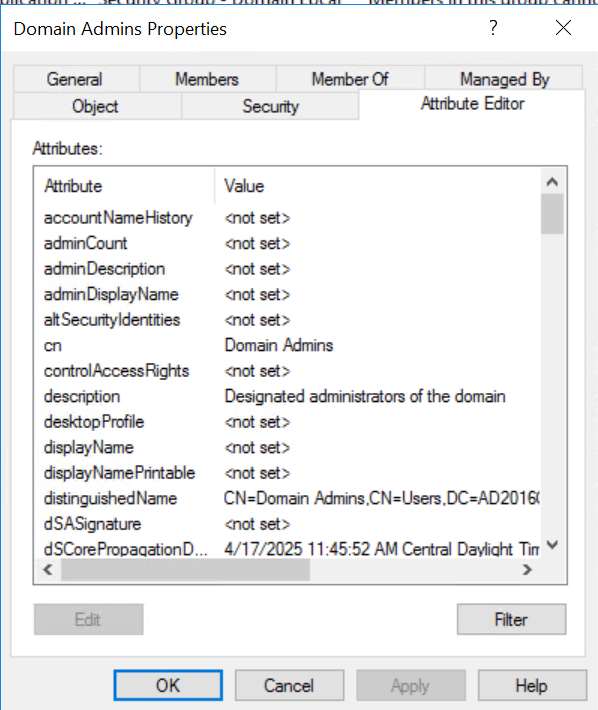
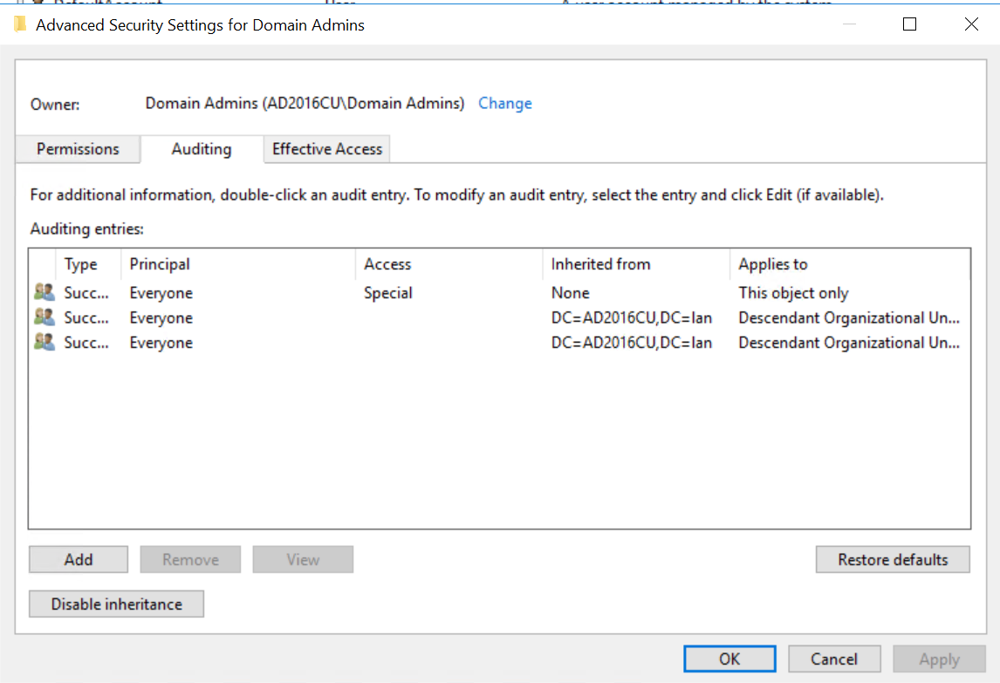
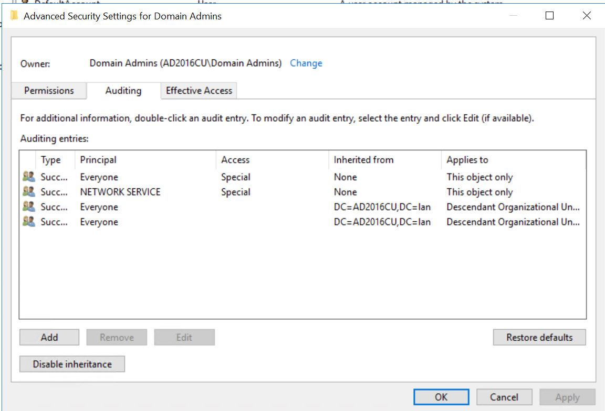
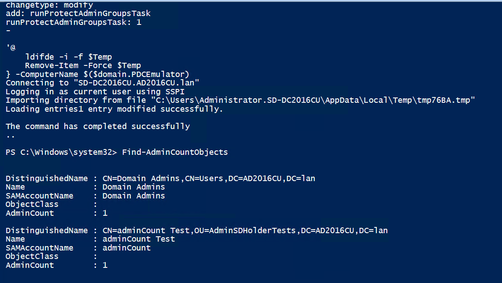
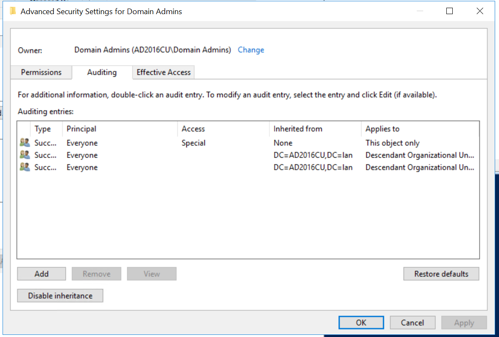
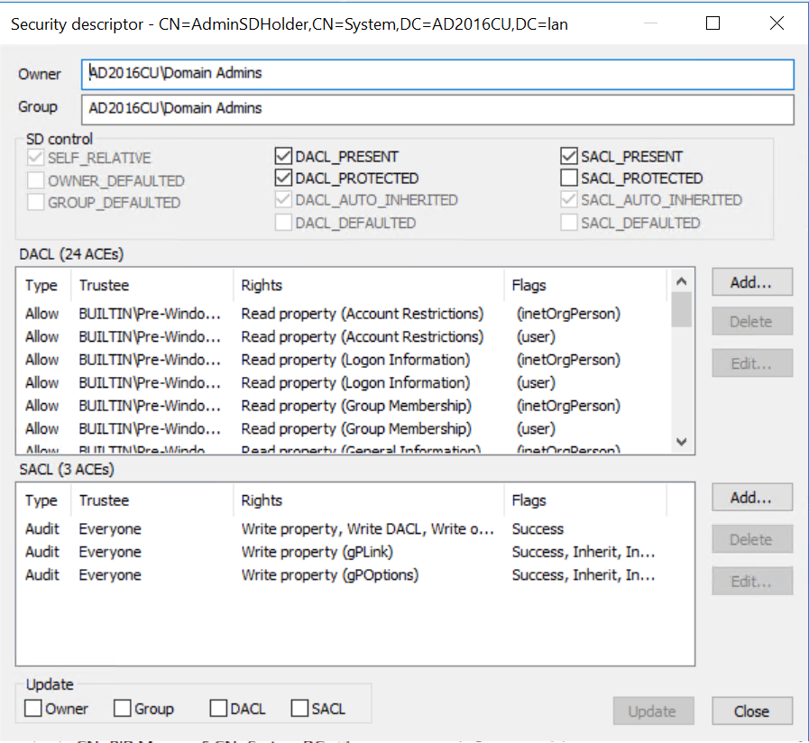
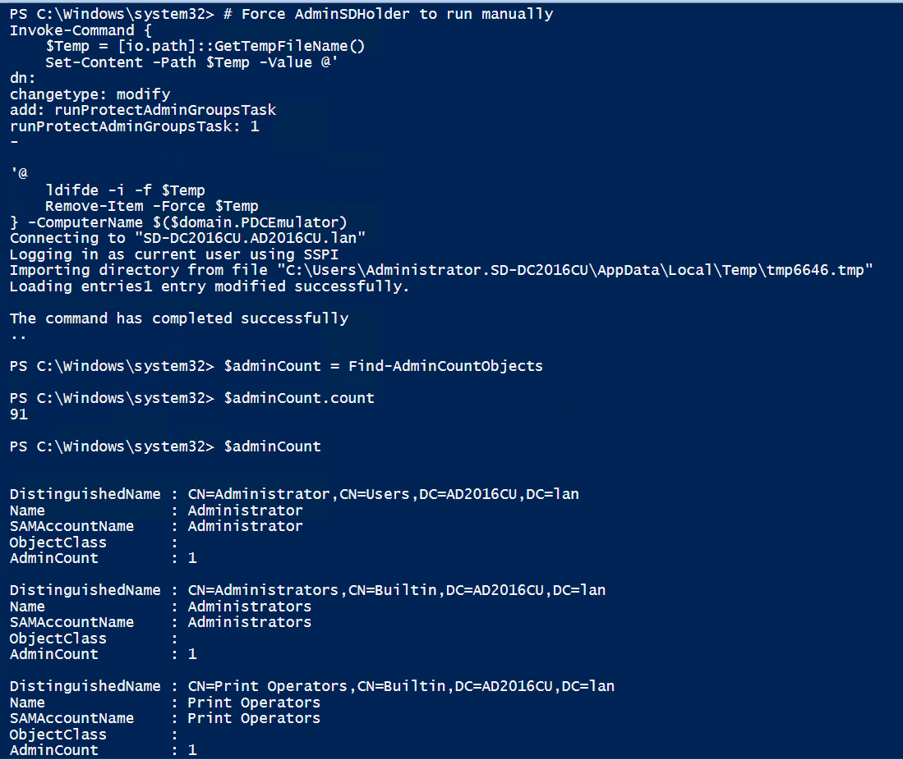

One of the key, actionable misconceptions around AdminSDHolder is the adminCount property.

The adminCount property is not used to determine if the ProtectAdminGroups (not SDProp) background task should apply the AdminSDHolder security descriptor. It hasn't been used for that purpose since at least Windows Server 2000 RC3, so prior to the release to manufacturer.

Additionally, adminCount is not a great indicator of whether a security principal or group is privileged or not. There are plenty of Tier Zero groups in even a default green-field deployment of AD which are not protected by AdminSDHolder and thus do not have an adminCount of 1. In an AD Forest that has been around for a while there are likely dozens if not hundreds of highly privileged principals which are not protected by AdminSDHolder and thus do not have an adminCount.

Also demonstrated in my whitepaper, it's possible to create an user (or other principal or group) and apply the exact security descriptor of AdminSDHolder to it and then add that principal to a protected group. AdminSDHolder's ProtectAdminGroups background task will protect it, but it won't set its adminCount unless that object's or AdminSDHolder's security descriptors are modified in the future.

This got me thinking, what if we have a whole set of objects that are protected by AdminSDHolder in an AD Forest, but just go through and clear the adminCount on all of them. What will happen? My hypothesis is that the objects will still be highly privileged, still be protected, and will no longer have an adminCount for misconstrued searches to determine privilege with. Let's find out!

## Nullified adminCount Test

For this test I'll be using the SD-DC2016CU domain controller in the AD2016CU.lan forest.

1. The baseline data I collect will be with a large set of principals that already have an adminCount. In other words, this forest has already had Create-AdminSDHolderTest.ps1 ran on it.
2. Collect baseline. From Test-AdminCountBaseline.csv/xlsx we can see that there are 91 objects with an adminCount of 1. 90 of those objects are protected by AdminSDHolder. CN=adminCount Test,OU=AdminSDHolderTests,DC=AD2016CU,DC=lan is not protected.
3. Next I'll pipe Find-AdminCountObjects into Clear-AdminCount. This results in 0 objects with an adminCount of 1, but just for fun I'll manually set the CN=adminCount Test,OU=AdminSDHolderTests,DC=AD2016CU,DC=lan user's adminCount back to 1.
4. Now the output of Find-AdminCountObjects is just:

```PowerShell
PS C:\Users\Administrator.SD-DC2016CU> Find-AdminCountObjects


DistinguishedName : CN=adminCount Test,OU=AdminSDHolderTests,DC=AD2016CU,DC=lan
Name              : adminCount Test
SAMAccountName    : adminCount
ObjectClass       :
AdminCount        : 1


PS C:\Users\Administrator.SD-DC2016CU>
```

5. The data captured here in Test-AdminCountStep4.csv/xlsx shows that there's only 1 object with an adminCount of 1, and it's the imposter that has no privileges at all and is not protected by AdminSDHolder. But just to be sure, let's manually force ProtectAdminGroups to run a couple of times and re-collect data, as demonstrated in Step5.txt
6. There are some Windows Updates to install on SD-2016CU so just to be absolutely sure that the adminCount won't reset, I'll reboot the server, which is the PDCe as the only DC in the forest, and then wait a while and check again. After a reboot and some time, and forcing ProtectAdminGroups to run manually a few more time there's only 1 principal with an adminCount of 1. And it's not Domain Admins:
   
   I'm quite confident that no matter how many times I manually force ProtectAdminGroups to run or how long I wait, the objects that are "supposed" to have an adminCount will not have one and the object that shouldn't have an adminCount will continue to have one.
7. How could we get the adminCount back on all the relevant objects? Make the AdminSDHolder security descriptor not match the security descriptor on all the protected objects. To do this we can modify any portion of the AdminSDHolder security descriptor, but first, let's modify the security descriptor of just Domain Admins and force ProtectAdminGroups. This will result in Domain Admins having an adminCount of 1 and the security descriptor being reverted back to that of AdminSDHolder. I won't even modify the DACL, I'll just add an ACE to the SACL.

- Default Domain Admins SACL:
  

- Modified Domain Admins SACL:
  

After forcing the ProtectAdminGroups task to run, the Domain Admins group now has an adminCount of 1 again and the NETWORK SERVICE ACE in the SACL I created is gone.

- Domain Admin has adminCount again, because ProtectAdminGroups modified the security descriptor, which is the step that results in adminCount being set.
  

- Domain Admin SACL reverted to default:
  

8. And if we modify any part of the AdminSDHolder security descriptor, even the SD Control flags, the protected objects will have their entire security descriptor overwritten by ProtectAdminGroups to match that of AdminSDHolder and thus adminCount will be set. The only change I'll make to the AdminSDHolder security descriptor is to set the SACL_PROTECTED flag:

- Before:
  

- After:
  

Now to kick off ProtectAdminGroups and check the results: - All principals are now protected by AdminSDHolder again, and each one of them, except the adminCount imposter user will now have a protected SACL:


    
